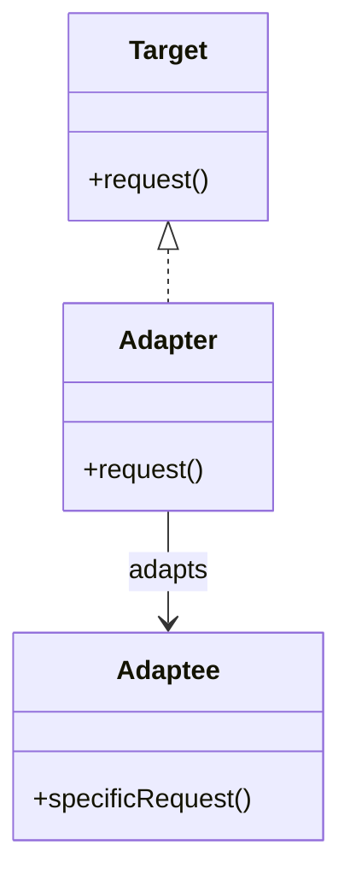
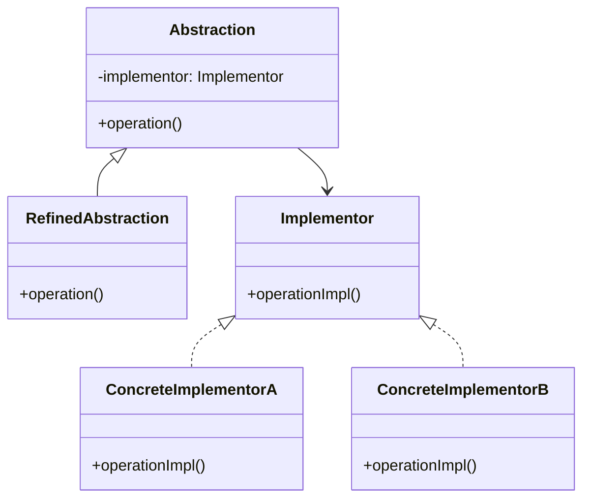

# 🔍 Adapter vs Bridge

## ✅ Purpose of Comparison

Both Adapter and Bridge are classified as _structural patterns_, but they serve different purposes. While their diagrams may appear similar at first glance, their design intent and usage scenarios diverge significantly. Understanding these distinctions helps engineers choose the most appropriate abstraction technique depending on the context—whether for retrofitting compatibility or promoting future extensibility.

## ✅ Comparison Overview

| Aspect           | Adapter                                         | Bridge                                     |
| ---------------- | ----------------------------------------------- | ------------------------------------------ |
| Primary Purpose  | Ensure compatibility with an existing interface | Separate abstraction and implementation    |
| Change Direction | Applied to existing classes (bottom-up)         | Designed from the start (top-down)         |
| Flexibility      | Low (wraps fixed interface)                     | High (independent extension of both sides) |
| Use Case Timing  | When integrating external or legacy components  | When designing extensible frameworks       |
| Reusability      | Limited to specific context                     | Broad across various implementations       |

## ✅ Similarities

- Both decouple classes to promote modularity and reduce tight coupling.
- Both introduce an intermediary layer between interface and implementation.
- Both are effective in managing changing requirements without modifying core logic.

## ✅ Key Differences

| Viewpoint        | Adapter                           | Bridge                                    |
| ---------------- | --------------------------------- | ----------------------------------------- |
| Direction of Use | Wraps existing code               | Designed proactively for extension        |
| Client Awareness | Client uses `Target` interface    | Client uses `Abstraction`                 |
| Flexibility      | Adapts one class at a time        | Enables N×M abstraction-implementation    |
| Change Frequency | Used when target can't be changed | Used when both sides evolve independently |
| Design Strategy  | Compatibility wrapper             | Layered extension architecture            |

## ✅ When to Use Which?

- ✅ Need to connect to **an existing, incompatible API** → Use **Adapter**
- ✅ Want to **separate concerns cleanly** for future growth → Use **Bridge**
- ✅ Working with **legacy systems** or third-party code → Adapter
- ✅ Building a **scalable, pluggable architecture** → Bridge

## ✅ UML Class Diagrams

### Adapter Pattern

### Bridge Pattern

## ✅ Practical Design Notes

- ✅ **Adapter is useful for ad-hoc integration**, but overuse can lead to structural complexity.
- ✅ **Bridge offers high extensibility**, but may require more upfront design effort.
- ▶️ Example:  
  Use `Adapter` when integrating with a legacy notification API.  
  Use `Bridge` when you want to separate notification types (e.g., error/warning) from delivery methods (e.g., email/Slack).

## ✅ Summary

- `Adapter` acts as a **retrofitted wrapper** to provide compatibility.
- `Bridge` is a **structural separation** of abstraction and implementation for extensibility.
- While the structures may look similar, they differ significantly in **intended usage and expansion direction**.
- Choosing the right pattern depends on the architectural goals at the time of design.
