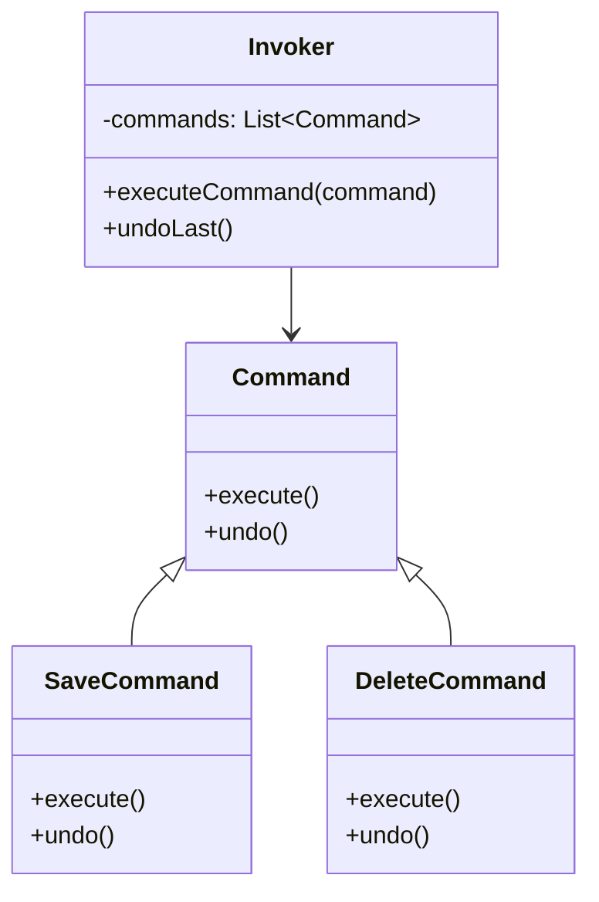
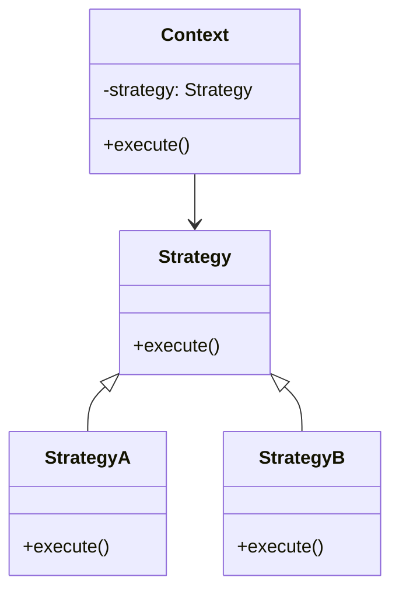

# 🔍 Command vs Strategy

## ✅ Purpose of Comparison

Both `Command` and `Strategy` patterns aim to abstract behavior into interchangeable objects. However, their **goals, application contexts, and control flow roles differ significantly**. This comparison outlines their structural differences, use cases, and practical design considerations to help choose the right pattern during architectural decision-making.

### ✅ Comparison Overview

| Aspect            | Command                                       | Strategy                                 |
| ----------------- | --------------------------------------------- | ---------------------------------------- |
| Purpose           | Encapsulate operations as objects             | Encapsulate algorithms or behaviors      |
| Usage             | Action history, undo/redo, deferred execution | Behavior switching at runtime            |
| Structure         | Operation object + receiver + invoker         | Strategy interface + concrete strategies |
| Reusability       | Commands are reusable as standalone actions   | Strategies are reusable behavior modules |
| Extension         | New actions = new command objects             | New behaviors = new strategy classes     |
| Typical Use Cases | GUI actions, batch jobs, undo mechanisms      | Payment calculation, sorting strategies  |

## ✅ Similarities

- Both encapsulate behavior in objects
- Use common interfaces to unify invocation structure
- Enable decoupling between caller and the actual logic
- Allow behavior replacement via object injection or configuration

## ✅ Key Differences

| Aspect            | Command                                           | Strategy                                    |
| ----------------- | ------------------------------------------------- | ------------------------------------------- |
| Purpose           | Encapsulate actions for invocation, undo, history | Encapsulate algorithms to allow replacement |
| Responsibility    | Represents a request or operation                 | Represents a behavioral policy              |
| Undo Capability   | ✅ Yes, via `undo()`                              | ❌ No built-in support                      |
| Invocation Model  | Used by an Invoker, often delayed                 | Used by a Context to delegate execution     |
| Primary Use Cases | Undo/Redo, queues, macros                         | Payment methods, sorting, formatting, etc.  |

## ✅ When to Choose Which

- ✅ Need to store, queue, or redo actions → **Command**
- ✅ Need to switch processing logic or algorithms → **Strategy**
- ✅ Want to treat operations as data → **Command**
- ✅ Want flexible injection of behavior → **Strategy**

## ✅ UML Class Diagram

### Command Pattern

### Strategy Pattern

## ✅ Practical Tips for Implementation

- ✅ **Use Command** when actions need to be tracked, queued, or reversed (e.g., text editors, batch jobs)
- ✅ **Use Strategy** when different policies or behaviors need to be injected at runtime (e.g., payment, logging)
- ▶️ **Combination possible**: A Command might internally use a Strategy to vary the behavior of the executed action.

## ✅ Summary

- `Command` is about **representing actions as objects**, enabling delayed execution and history management.
- `Strategy` is about **selecting and injecting behavior**, promoting algorithm flexibility and configurability.
- Despite similar interface shapes, their **design intent differs**: one focuses on **when and how to execute an operation**, the other on **which behavior to apply**.
