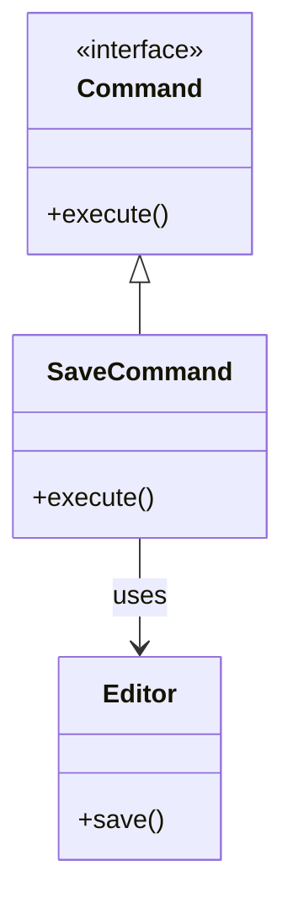
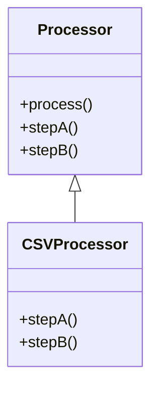

# 🔍 Command vs Template Method

## ✅ Purpose of Comparison

Both Command and Template Method are powerful design patterns for **structuring processing logic** and **increasing modularity**.  
While they may appear similar in enabling step-level customization, they are fundamentally different in **control flow**, **flexibility**, and **intent**.

This comparison highlights key distinctions and use cases to help determine which pattern best suits a given design problem.

## ✅ Comparison Overview

| Item             | Command                                             | Template Method                           |
| ---------------- | --------------------------------------------------- | ----------------------------------------- |
| Implementation   | Interface + object injection                        | Abstract class inheritance                |
| Flexibility      | High (commands can be changed at runtime)           | Moderate (execution flow is fixed)        |
| Testability      | High (individual commands are testable)             | Moderate (requires testing via subclass)  |
| Primary Use Case | Delayed execution, action logging, macro operations | Fixed process flow with overridable steps |
| Extensibility    | High (add more commands as needed)                  | Moderate (limited customization points)   |
| Usage Style      | Encapsulate each behavior as an object              | Define a fixed algorithm structure        |

## ✅ Similarities

- Both aim to **modularize behavior** and isolate points of variation.
- Both use **interface abstraction or method overriding** to delegate specific logic.
- Both improve **reusability** and **clarity of processing steps** compared to inline logic.

## ✅ Key Differences

| Aspect                  | Command                                       | Template Method                                       |
| ----------------------- | --------------------------------------------- | ----------------------------------------------------- |
| Control Flow            | Client controls execution by passing commands | Superclass dictates the flow                          |
| Reusability Granularity | Fine-grained (individual commands)            | Coarse-grained (entire flow)                          |
| State Handling          | Commands can hold and track internal state    | Mostly stateless, focused on step-level customization |
| Execution Timing        | Supports deferred or asynchronous execution   | Executed immediately when called                      |

## ✅ When to Choose Which

- ✅ Need for **action recording, queuing, or delayed invocation** → **Command**
- ✅ Have a **fixed process with interchangeable steps** → **Template Method**
- ✅ Want to **log or undo operations** → **Command**
- ✅ Need **standardized flow with minor variations** → **Template Method**

## ✅ UML Class Diagram

### Command Pattern

### Template Method Pattern

## ✅ Practical Tips for Implementation

- ✅ **Command** is ideal for features like **Undo/Redo**, macros, and **action logging**, particularly in GUI or CLI tools.
- ✅ **Template Method** shines in structured tasks like **report generation, data export**, and **file processing**, where the flow is mostly static.
- ▶️ In scenarios where you need both **a fixed sequence and dynamic behavior injection**, a **synergistic approach** may be valuable—e.g., using Command objects within a Template Method flow.

## ✅ Summary

- **Command** encapsulates behavior as standalone objects, providing **maximum flexibility and control** over execution timing and composition.
- **Template Method** enforces a **consistent processing structure** while allowing fine-grained customization via method overrides.
- Choosing the right pattern depends on the **required level of runtime flexibility**, **processing granularity**, and **design control**.
