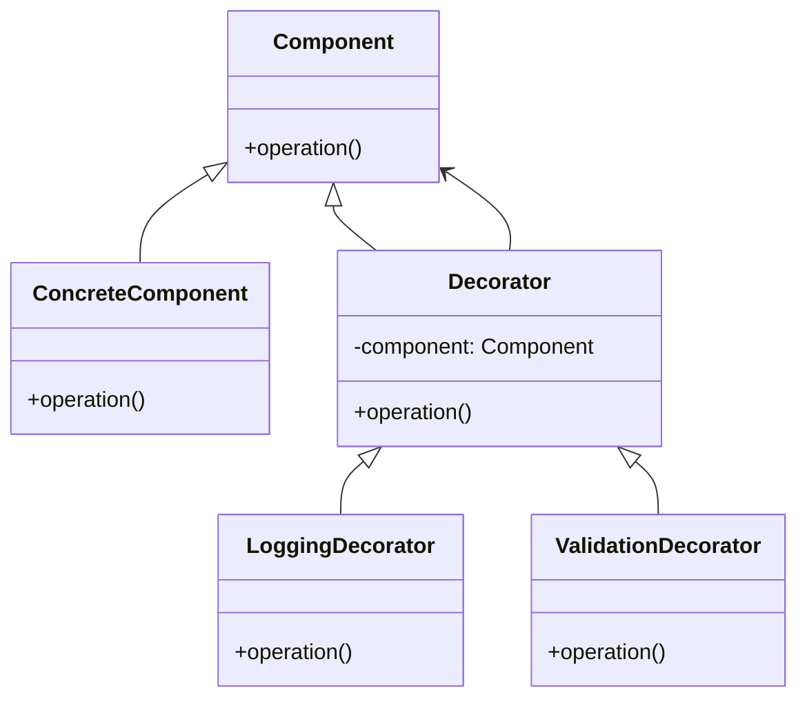
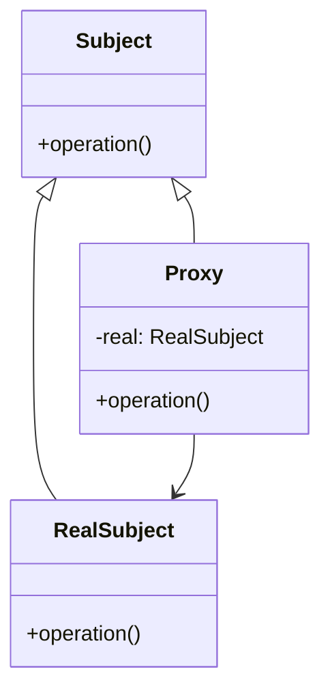

# 🔍 Decorator vs Proxy

## ✅ Purpose of Comparison

Both Decorator and Proxy follow a similar structural pattern—wrapping another object with the same interface. However, they differ fundamentally in their **intent** and **application**. This comparison clarifies how and when to use each.

## ✅ Comparison Overview

| Aspect           | Decorator                                 | Proxy                                      |
| ---------------- | ----------------------------------------- | ------------------------------------------ |
| Purpose          | Add responsibilities or features          | Control access or add indirection          |
| Primary Use Case | Enhance behavior (e.g., logging, caching) | Control access (e.g., lazy loading, auth)  |
| Object Creation  | Can be stacked in layers                  | Usually 1-to-1 with the real subject       |
| Transparency     | May introduce side effects                | Often aims to be transparent to the caller |
| Structural Form  | Chain of wrappers                         | Surrogate for one specific object          |

## ✅ Similarities

- Both implement the **same interface** as the wrapped object.
- Both **wrap another class** internally.
- Both are used to **extend functionality without modifying the original**.

## ✅ Key Differences

| Aspect              | Decorator                            | Proxy                              |
| ------------------- | ------------------------------------ | ---------------------------------- |
| Design Intent       | Add new responsibilities dynamically | Restrict or manage access          |
| Runtime Flexibility | Multiple decorators can be layered   | Typically used as a static wrapper |
| Client Awareness    | May know it’s using a decorator      | Usually unaware it’s using a proxy |

## ✅ When to Choose Which

- ✅ Want to **dynamically add behavior** at runtime → use **Decorator**
- ✅ Need to **enforce access control, logging, or lazy loading** → use **Proxy**
- ✅ Expect **multiple behavior combinations** → Decorator is more appropriate
- ✅ Just want a single layer to **intercept or guard access** → Proxy is simpler

## ✅ UML Class Diagram

### Decorator Pattern

### Proxy Pattern

## ✅ Practical Tips for Implementation

- ✅ **Decorator** is ideal when you want to **chain multiple features** (e.g., logging + validation).
- ✅ **Proxy** is best when you need a **guard layer** like authentication, permission checks, or caching.
- ▶️ In real-world design, they may even coexist—for example, **a Proxy that wraps a Decorator**, or vice versa.

## ✅ Summary

- `Decorator` focuses on **behavioral enhancement**, often used in layers.
- `Proxy` focuses on **access control or interface indirection**.
- While structurally similar, they serve **distinct design intents**.
- Clear identification of your purpose—**behavior extension vs access management**—is key to selecting the right pattern.
