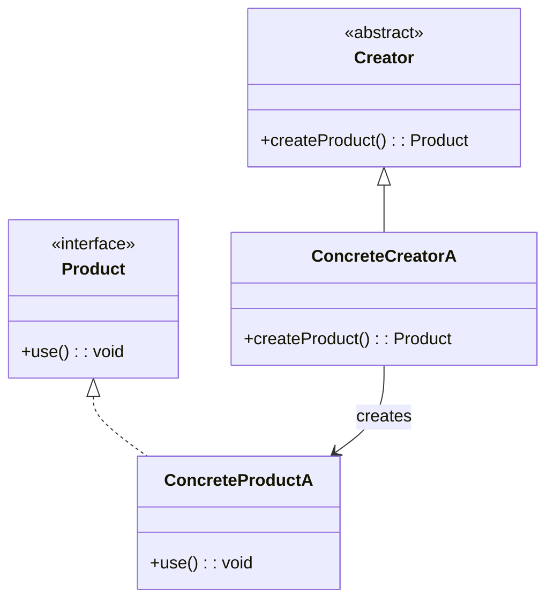
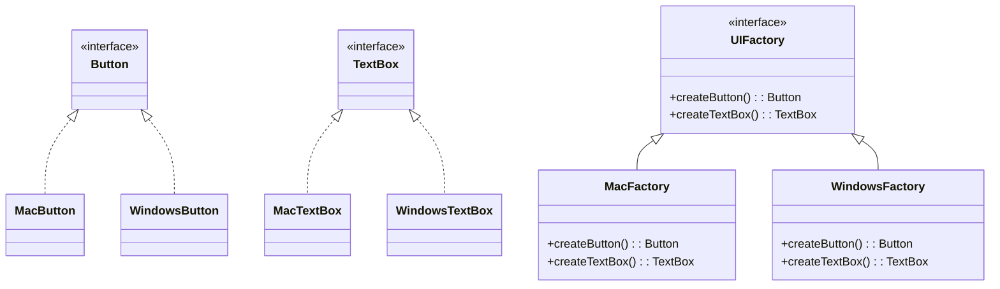

# 🔍 Factory Method vs Abstract Factory

## ✅ Purpose of Comparison

Both Factory Method and Abstract Factory are creational patterns used to encapsulate object creation. However, they differ in **scale**, **responsibility**, and **intended use**. This page compares their structure and use cases to clarify which pattern suits a given scenario.

## ✅ Comparison Overview

| Aspect        | Factory Method                                | Abstract Factory                                               |
| ------------- | --------------------------------------------- | -------------------------------------------------------------- |
| Focus         | Creation of a **single object**               | Creation of a **family of related objects**                    |
| Structure     | Abstract method in base class creates product | A factory interface creates multiple product types             |
| Extensibility | Easy to add new product types                 | Good for managing multiple object types across families        |
| Coupling      | Low (based on a product interface)            | Higher complexity but clearer coordination across product sets |
| Typical Use   | When subclass decides what to instantiate     | When consistent object families are required                   |

## ✅ Similarities

- Both abstract the instantiation process to reduce dependency on concrete classes.
- Both improve extensibility by centralizing creation logic.
- Both adhere to the **Open/Closed Principle**, allowing extensions without modification.

## ✅ Key Differences

| Aspect             | Factory Method                                 | Abstract Factory                                |
| ------------------ | ---------------------------------------------- | ----------------------------------------------- |
| Product Scope      | Single product                                 | Multiple related products (families)            |
| Client Interaction | Subclass decides what to return                | Factory provides families via interface         |
| Usage Complexity   | Simpler                                        | More structured but heavier setup               |
| Flexibility        | Easy to plug different product implementations | Maintains consistency across related components |

## ✅ UML Class Diagrams

### Factory Method Pattern

### Abstract Factory Pattern

## ✅ Practical Design Notes

- ✅ **Use Factory Method** when you need a flexible way to create **one type of object** at a time (e.g., single plugin or handler).
- ✅ **Use Abstract Factory** when object consistency matters, like building a **UI theme** or **cross-platform toolkit**.
- 🔁 Factory Method can be part of Abstract Factory’s internal structure to create individual items.

## ✅ Summary

- `Factory Method` encapsulates **how to create a single object**.
- `Abstract Factory` provides a **group of related object creators**.
- Abstract Factory is ideal when multiple coordinated products must be consistent.
- Choose based on the **scope of creation**: if you need consistency across multiple products, go with **Abstract Factory**; otherwise, **Factory Method** may be sufficient.
