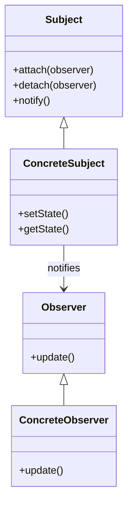
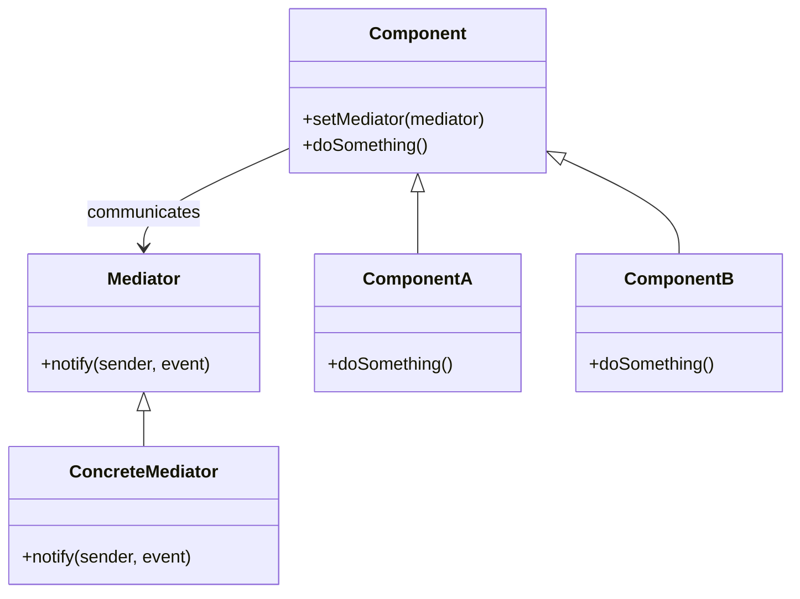

# 🔍 Observer vs Mediator

## ✅ Purpose of Comparison

`Observer` and `Mediator` are both design patterns used to manage communication between multiple objects.  
However, they differ fundamentally in their **direction of communication** and **structural centralization**.  
This comparison highlights the structural distinctions and usage scenarios to help in selecting the appropriate pattern.

## ✅ Comparison Overview

| Aspect        | Observer                                          | Mediator                                                 |
| ------------- | ------------------------------------------------- | -------------------------------------------------------- |
| Intent        | Notify dependent objects of state changes         | Centralize communication between multiple components     |
| Primary Use   | Reactive updates, event notification              | UI coordination, chat systems, multi-component workflows |
| Structure     | Publisher holds and notifies Subscribers          | Mediator coordinates interactions among Participants     |
| Reusability   | Notification logic decoupled from recipients      | Components reusable without depending on each other      |
| Extensibility | Add new Subscribers for extended behavior         | Change Mediator to alter interaction patterns centrally  |
| Downsides     | Can become tangled with complex dependency chains | Mediator tends to grow large and complex                 |

## ✅ Similarities

- Both manage collaboration between multiple objects
- Triggered by state changes or events
- Promote **loose coupling** by decoupling direct interactions

## ✅ Key Differences

| Aspect               | Observer                                            | Mediator                                              |
| -------------------- | --------------------------------------------------- | ----------------------------------------------------- |
| Communication        | **Unidirectional** (Subject → Observer)             | **Bidirectional or multi-directional** (via Mediator) |
| Centralization       | None (decentralized notification)                   | Present (centralized coordination)                    |
| Scalability          | Becomes harder to manage as observers grow          | Easier to manage via central coordination             |
| Dependency Structure | Can lead to many-to-many dependencies               | Reduces direct dependencies via a single point        |
| Typical Use Case     | State change notifications (UI updates, monitoring) | Complex coordination (chat apps, UI integration)      |

## ✅ When to Choose Which

- ✅ Use **Observer** when you want to **broadcast state changes**
- ✅ Use **Mediator** when you want to **coordinate multiple participants**
- ✅ Choose **Observer** for **event-driven reactions**
- ✅ Choose **Mediator** for **structured control flow between components**

## ✅ UML Class Diagram

### Observer Pattern

### Mediator Pattern

## ✅ Practical Design Notes

- ✅ **Observer** is useful for live updates (e.g., UI refresh, metric notifications), but **too many observers** can lead to complex control logic.
- ✅ **Mediator** excels when **multiple components interact with each other**, offering a centralized structure to coordinate their behavior.
- ▶️ Example: If you want to notify multiple parts about a change, use `Observer`; if you want to manage interdependent UI logic centrally, use `Mediator`.

## ✅ Summary

- `Observer` is designed for **state change notification** and fits **decentralized reaction-based designs**
- `Mediator` is intended for **interaction coordination**, offering **centralized control** among components
- Both patterns reduce tight coupling, but differ in structure: **decentralized vs centralized**
