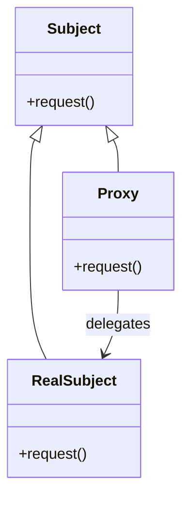
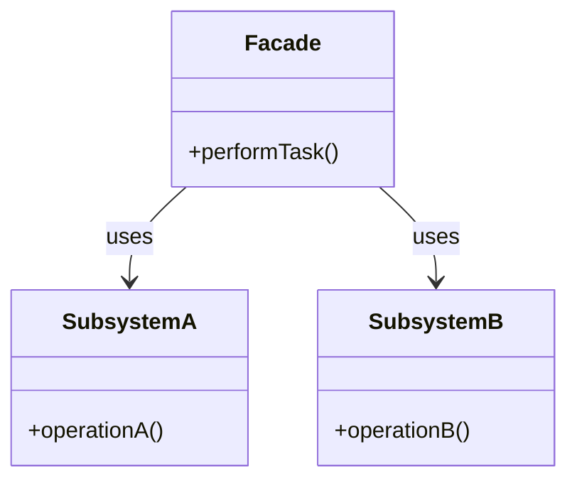

# 🔍 Proxy vs Facade

## ✅ Purpose of Comparison

Both `Proxy` and `Facade` introduce intermediary objects that stand between the client and the actual processing logic.  
Despite having similar structural roles, they serve entirely different design goals.  
This comparison clarifies their distinct responsibilities and provides practical guidance for selecting the appropriate pattern.

## ✅ Comparison Overview

| Aspect           | Proxy                                              | Facade                                                 |
| ---------------- | -------------------------------------------------- | ------------------------------------------------------ |
| Purpose          | Add control or additional logic around real access | Simplify access to a complex subsystem                 |
| Primary Use      | Access control, lazy loading, caching, logging     | Combine multiple operations under a unified interface  |
| Structure        | Implements the same interface as the real subject  | Wraps multiple subsystems behind a single interface    |
| Scope            | One-to-one (single object proxy)                   | One-to-many (multiple operations exposed as one)       |
| Client Awareness | Clients may not realize they're using a proxy      | Clients clearly interact through the simplified facade |
| Extensibility    | Easy to inject pre/post-processing logic           | Internal changes do not affect the external interface  |

## ✅ Similarities

- Both act as wrapper objects that abstract access to other classes or systems
- Help simplify client-side code and promote loose coupling
- Often used to provide a **controlled or simplified interface** to internal components

## ✅ Key Differences

| Aspect          | Proxy                                                 | Facade                                            |
| --------------- | ----------------------------------------------------- | ------------------------------------------------- |
| Primary Purpose | Access control, lazy loading, logging, caching, etc.  | Unifying complex subsystems behind a simple API   |
| Usage Timing    | When access needs to be intercepted or deferred       | When subsystem complexity should be hidden        |
| Responsibility  | Delegates directly to the real object (`RealSubject`) | Orchestrates multiple components and operations   |
| Structure       | Implements the same interface as the real object      | Defines a new high-level interface                |
| Extensibility   | Easy to inject pre/post logic around operations       | Easy to hide internal complexity from the outside |

## ✅ When to Choose Which

- ✅ Need to wrap behavior around individual object access → **Proxy**
- ✅ Need to offer a unified interface to multiple subsystems → **Facade**
- ✅ Want to delay, cache, or log method calls → **Proxy**
- ✅ Want to hide subsystem complexity and offer simpler API → **Facade**

## ✅ UML Class Diagram

### Proxy Pattern

### Facade Pattern

## ✅ Practical Design Notes

- ✅ `Proxy` is best suited for **controlling or enriching access** to a single object, such as adding logging, security, caching, or lazy evaluation.
- ✅ `Facade` excels at **hiding complexity** by providing a high-level entry point that orchestrates multiple operations behind the scenes.
- ▶️ Example: Using a caching proxy for a network API → `Proxy`; creating a unified SDK interface for multiple internal services → `Facade`

## ✅ Summary

- `Proxy` is a **control-layer wrapper** used for access mediation or augmentation
- `Facade` is an **integration-layer gateway** used for simplifying complex subsystems
- While both use indirection, they differ fundamentally in **intent and scope**
- Choose based on whether the focus is **controlling individual access** (`Proxy`) or **streamlining high-level usage** (`Facade`)
