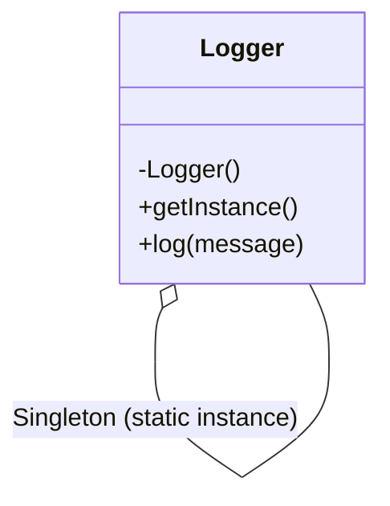
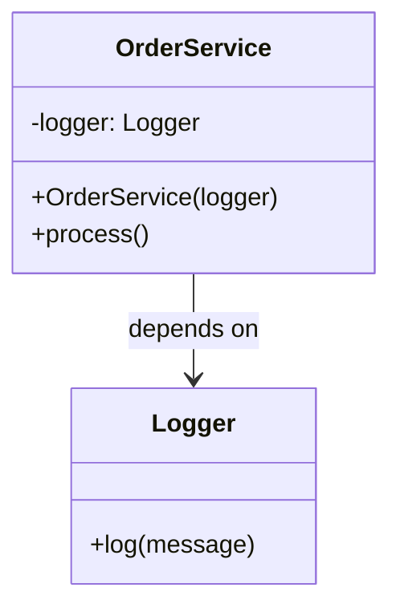

# 🔍 Singleton vs Dependency Injection

## ✅ Purpose of Comparison

Both patterns aim to share and reuse a single instance of an object across an application. However, their design principles and control responsibilities differ significantly.  
This comparison clarifies their intended use cases, structural differences, and how to choose the right one based on your design goals.

## ✅ Comparison Overview

| Aspect | Singleton | Dependency Injection (DI) |
| -- | | -- |
| Purpose | Ensure a single global instance | Make dependencies explicit and injectable |
| Lifecycle | One instance across the entire application | Controlled by caller or dependency container |
| Flexibility | Low (hard to replace the instance) | High (easily switch between implementations) |
| Testability | Low (tight coupling makes testing harder) | High (can inject mocks/stubs easily) |
| Visibility | Low (hides dependencies inside the class) | High (dependencies are clearly visible) |
| Usage Style | Use `getInstance()` to access internally created | Inject via constructor or a DI container |

## ✅ Similarities

- Both are used to **share a common object across the application**, such as configuration, logging, or other shared services.
- Often used in situations that require **application-wide access** to a service or resource.
- If overused, both can increase coupling and **reduce testability and maintainability**.

## ✅ Key Differences

| Aspect | Singleton | Dependency Injection (DI) |
| - | | |
| Instance Control | The class itself controls the instance | The caller or DI container manages it |
| Ownership | Internal (self-managed) | External (caller-managed) |
| Flexibility | Low – always returns the same instance | High – dependencies can be swapped (e.g., mocks) |
| Testability | Low – relies on global state | High – test doubles can be injected |
| Intent | Restrict creation of multiple instances | Decouple creation and usage of dependencies |

## ✅ When to Choose Which

- ✅ Need to enforce a **single, globally consistent instance** → Use **Singleton**
- ✅ Want to **inject different implementations** for testing, environment, or configuration → Use **DI**
- ✅ Prefer logic to be **self-contained in the class** → Use **Singleton**
- ✅ Prefer to **control dependencies externally** for better flexibility → Use **DI**

## ✅ UML Class Diagram

### Singleton Pattern

### Dependency Injection

## ✅ Practical Tips for Implementation

- ✅ **Singleton** is simple and effective but can hurt **testability and flexibility** when overused.
- ✅ **DI** enables better **mocking and swapping** of dependencies in tests and across environments.
- ▶️ Example: Use **Singleton** for truly global and unchangeable instances (e.g., app configuration or logging), but prefer **DI** for anything that may vary by context or require testing flexibility.

## ✅ Summary

- **Singleton**: Self-managed instance control; the object enforces its own uniqueness.
- **DI**: Externalized dependency management; the caller decides what to use.
- Despite surface-level similarities, they differ in **ownership, flexibility, and testability**.
- For most modern applications, **DI offers more flexibility and testability**. Singleton should be used **sparingly and intentionally**.
