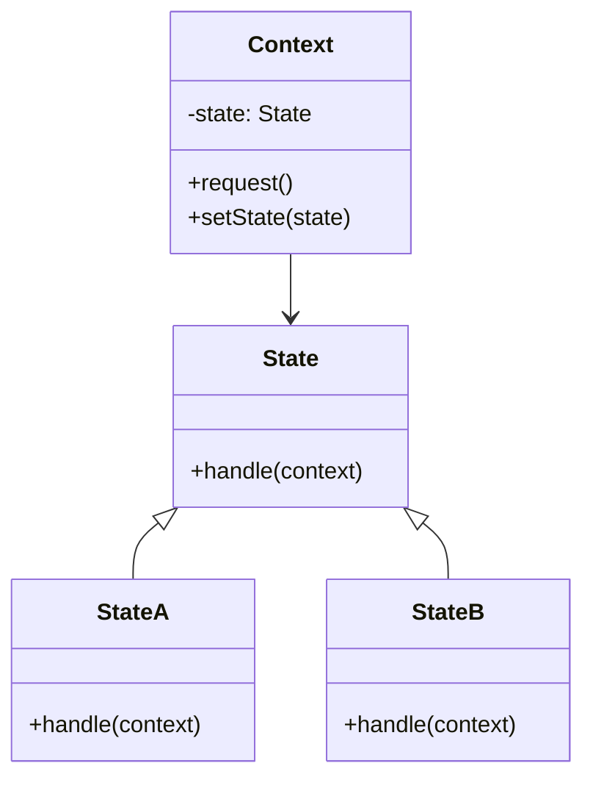
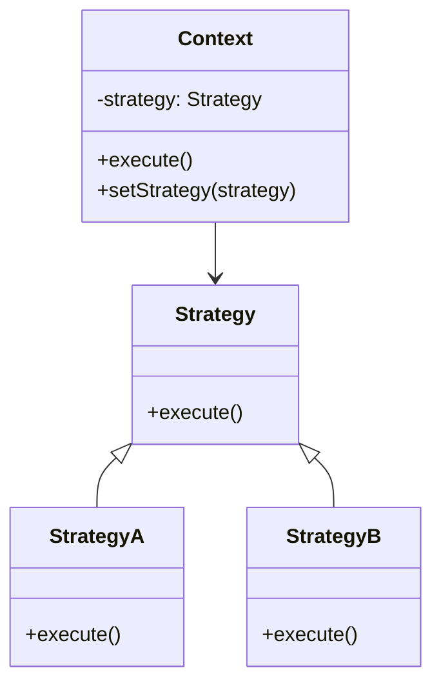

# 🔍 State vs Strategy

## ✅ Purpose of Comparison

The `State` and `Strategy` patterns both aim to **enable interchangeable behaviors**, but they serve **different design purposes**. This comparison clarifies when to use each pattern by examining their intent, structure, and usage in practice.

## ✅ Comparison Overview

| Aspect              | State                                   | Strategy                               |
| ------------------- | --------------------------------------- | -------------------------------------- |
| Primary Purpose     | Switch behavior based on internal state | Switch behavior via external strategy  |
| Structure           | Delegates to state-specific classes     | Delegates to strategy-specific classes |
| Trigger for Change  | Internal state transitions              | External configuration or injection    |
| Switching Mechanism | Object manages its own state transition | Client selects and injects strategy    |
| State Management    | Maintains current state                 | Stateless, focuses on algorithms       |

## ✅ Similarities

- Both patterns support **behavioral flexibility** without complex conditionals.
- Behavior is delegated via **shared interfaces**, improving extensibility.
- Used to **encapsulate variant logic** and reduce code duplication.

## ✅ Key Differences

| Perspective       | State Pattern                               | Strategy Pattern                        |
| ----------------- | ------------------------------------------- | --------------------------------------- |
| Ownership         | Controlled by the object’s internal logic   | Controlled by the external caller       |
| Dynamic Switching | State transitions happen within the object  | Strategy changes happen externally      |
| Concept of State  | Explicit stateful behavior with transitions | Stateless, context-independent behavior |
| Client Role       | Unaware of internal state handling          | Responsible for selecting strategy      |

## ✅ When to Choose Which

- ✅ Use **State** when behavior depends on the **object's internal condition**
- ✅ Use **Strategy** when you need to **switch algorithms or policies externally**
- ✅ Choose **State** when transitions happen as part of object workflow
- ✅ Choose **Strategy** when you need configurable or testable behaviors

## ✅ UML Class Diagram

### State Pattern

### Strategy Pattern

## ✅ Practical Design Notes

- ✅ **Use State** when implementing domain logic that changes over time (e.g., login status, order phases).
- ✅ **Use Strategy** when separating interchangeable policies or behaviors (e.g., notification methods, authentication).
- ▶️ These patterns are often confused—understand **who initiates the change** and **where state is stored**.

## ✅ Summary

- `State` encapsulates behavior changes **based on internal transitions**.
- `Strategy` encapsulates **interchangeable behaviors** selected externally.
- While structurally similar, they differ in **control flow and behavioral ownership**.
- Choosing the correct pattern depends on whether flexibility is required in **internal evolution** or **external configuration**.
