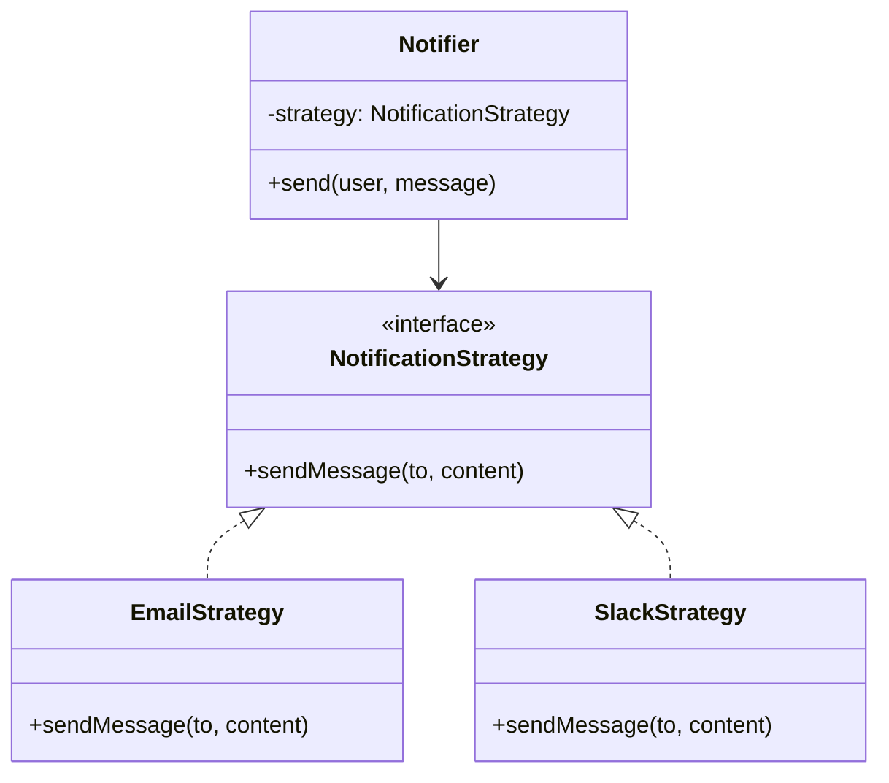
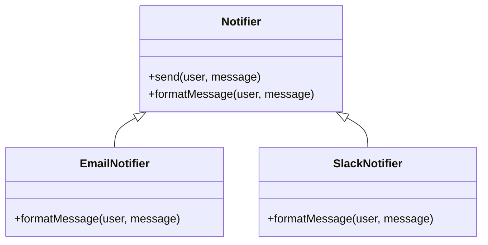

# 🔍 Strategy vs Template Method

## ✅ Purpose of Comparison

The `Strategy` and `Template Method` patterns both aim to make a portion of behavior interchangeable.  
However, they differ significantly in terms of **how the variation is structured**, **when it is decided**, and **who controls the flow**.

This section clarifies those differences and provides practical guidelines for selecting the right pattern based on context.

## ✅ Comparison Overview

| Aspect             | Strategy                            | Template Method                             |
| ------------------ | ----------------------------------- | ------------------------------------------- |
| Implementation     | Delegation (injecting interface)    | Inheritance (subclassing an abstract class) |
| Flexibility        | High (can switch at runtime)        | Moderate (fixed at class design)            |
| Reusability        | High (reusable in various contexts) | Lower (tightly coupled with inheritance)    |
| Structural Clarity | Clear (explicit via DI)             | Less visible (overridden internally)        |
| Testability        | High (mocks/stubs easily injected)  | Moderate (method behavior is fixed)         |

## ✅ Similarities

- Both patterns are used to **replace a portion of behavior** within a common structure.
- Rely on **interfaces or abstract methods** to externalize variation.
- Aim to promote **maintainability** by decoupling "what changes" from "what remains fixed".

## ✅ Key Differences

| Perspective         | Strategy                    | Template Method                   |
| ------------------- | --------------------------- | --------------------------------- |
| Variation Mechanism | **Injection (composition)** | **Inheritance (extension)**       |
| Runtime Switching   | ✅ Possible                 | ❌ Not possible (class is fixed)  |
| Client Structure    | Just pass a Strategy object | Must define and subclass          |
| Control Ownership   | Held by caller              | Held by base class (flow defined) |

## ✅ When to Choose Which

- ✅ Need to switch behavior flexibly → **Strategy**
- ✅ The overall flow must remain fixed → **Template Method**
- ✅ Want runtime injection or user-defined behavior → **Strategy**
- ✅ Want to enforce a fixed procedure with minor variations → **Template Method**

## ✅ UML Class Diagram

### Strategy Pattern

### Template Method Pattern

## ✅ Practical Tips for Implementation

- ✅ **Using only Template Method**: Ensures a unified structure, but may lead to inflexible and inheritance-heavy designs.
- ✅ **Using only Strategy**: Offers flexibility but may result in scattered or inconsistent flow control.
- ▶️ **Combining both is often ideal**: Use Template Method for the procedural flow and Strategy for variable operations (e.g., delivery method).

## ✅ Summary

`Strategy` and `Template Method` are both fundamental patterns for achieving flexible, reusable design.  
However, they differ in how they separate variation, when the variation is determined, and where the responsibility lies.

- Choose **Strategy** for dynamic switching and external control.
- Choose **Template Method** for enforcing a fixed sequence with customizable steps.

The key is to consider future changes and the flow of control when deciding between the two patterns.
