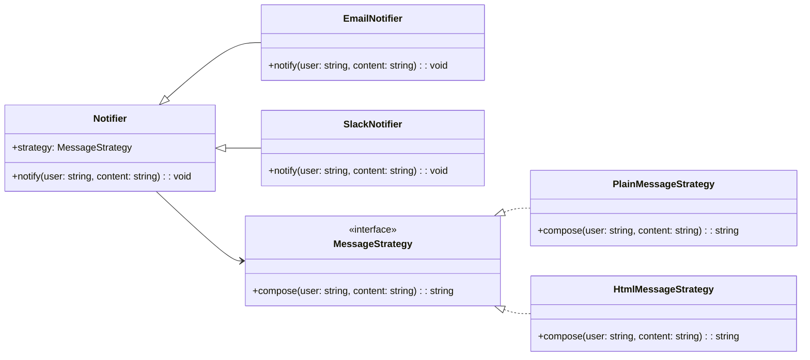

import Tabs from "@theme/Tabs";
import TabItem from "@theme/TabItem";
import CodeBlock from "@theme/CodeBlock";

import tsCode from "@site/src/codes/ref-synergy/ts/state-strategy.ts";
import phpCode from "@site/src/codes/ref-synergy/php/state-strategy.php";
import pyCode from "@site/src/codes/ref-synergy/py/state-strategy.py";

# 🧩 Bridge × Strategy

## ✅ Intent of the Combination

- The `Bridge` pattern separates the **notification channel (e.g., Email / Slack)** from the **message formatting logic (e.g., Plain / HTML)**, allowing both to be extended independently.
- The `Strategy` pattern externalizes the message formatting behavior, enabling flexible combinations of **notification channel × message style**.

This design consolidates common notification behavior within `Notifier`, while allowing flexible injection of both the communication method and message formatting strategy.

## ✅ When to Use

- When you want to flexibly combine **how a message is sent** (Email, Slack, etc.) and **how the message is structured** (Plain text, HTML, Markdown, etc.).
- When the system requires **independent extensibility across multiple axes**, such as output channels and content structure.
- When designing systems with **two or more independent concerns**, such as _UI vs. theme_, or _data vs. rendering method_.

## ✅ UML Class Diagram

## ✅ Code Example

<Tabs groupId="language">
  <TabItem value="ts" label="TypeScript">
    <CodeBlock language="ts">{tsCode}</CodeBlock>
  </TabItem>
  <TabItem value="php" label="PHP">
    <CodeBlock language="php">{phpCode}</CodeBlock>
  </TabItem>
  <TabItem value="python" label="Python">
    <CodeBlock language="python">{pyCode}</CodeBlock>
  </TabItem>
</Tabs>

## ✅ Explanation

- `Notifier` is the abstraction that defines the notification flow. It holds a reference to a `MessageStrategy` to delegate message formatting (`Strategy`).
- `EmailNotifier` and `SlackNotifier` are concrete implementations of notification channels (implementors in the `Bridge`).
- `MessageStrategy` defines how a message is built. It can be swapped dynamically (e.g., `PlainMessageStrategy`, `HtmlMessageStrategy`).
- The architecture enables **independent extensibility** of both how messages are sent and how they're formatted.

## ✅ Summary

- `Bridge` separates the concerns of **how to send a message** from **how to build it**, allowing independent extension.
- `Strategy` allows the **message structure** to be injected and changed dynamically.
- This combination supports **high flexibility and reusability**, ideal for real-world systems where content and delivery vary independently.

This architecture is especially effective in real-world applications where multiple dimensions of extensibility are required, boosting maintainability and scalability.
