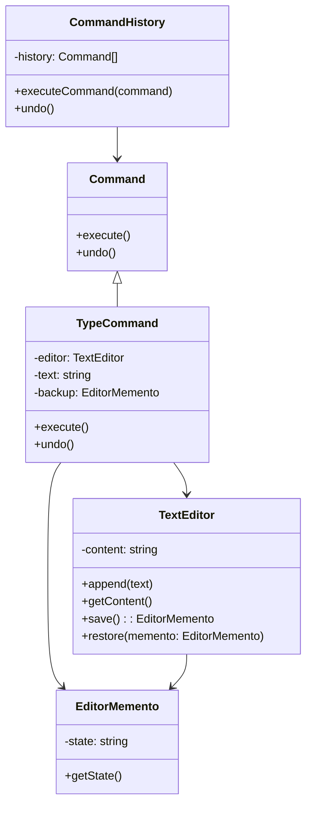

import Tabs from "@theme/Tabs";
import TabItem from "@theme/TabItem";
import CodeBlock from "@theme/CodeBlock";

import tsCode from "@site/src/codes/ref-synergy/ts/command-memento.ts";
import phpCode from "@site/src/codes/ref-synergy/php/command-memento.php";
import pyCode from "@site/src/codes/ref-synergy/py/command-memento.py";

# 🧩 Command × Memento

## ✅ Combined Intent

- Use the `Command` pattern to encapsulate operations (like input) as objects and enable history tracking.
- Use the `Memento` pattern to capture and restore the internal state of objects.

This combination enables a structure where you can track **what was done** and also **what the system's state was** at that time — allowing both command replay and full state rollback.

## ✅ Common Use Cases

- Applications like text editors or drawing tools where Undo/Redo is essential.
- Tools that require change tracking (e.g., batch updates, system configurations).
- When both user actions and internal states need to be recorded and reverted.

## ✅ UML Class Diagram

## ✅ Code Example

<Tabs groupId="language">
  <TabItem value="ts" label="TypeScript">
    <CodeBlock language="ts">{tsCode}</CodeBlock>
  </TabItem>
  <TabItem value="php" label="PHP">
    <CodeBlock language="php">{phpCode}</CodeBlock>
  </TabItem>
  <TabItem value="python" label="Python">
    <CodeBlock language="python">{pyCode}</CodeBlock>
  </TabItem>
</Tabs>

## ✅ Explanation

- `TextEditor` holds the current text and acts as the **Receiver**, also implementing state snapshot functionality (`Memento`).
- `TypeCommand` represents a text input operation as a `Command`, and saves a snapshot before execution.
- `CommandHistory` stores the list of commands and provides `undo()` functionality.

By combining these patterns, we can **decouple input behavior and state recovery**, allowing for a clean and maintainable Undo/Redo system.

## ✅ Summary

- **Command**: Encapsulates operations and enables command history.
- **Memento**: Captures and restores object state.
- Their combination allows tracking of both actions and states.
- Ideal for implementing undoable workflows and reliable state transitions.
