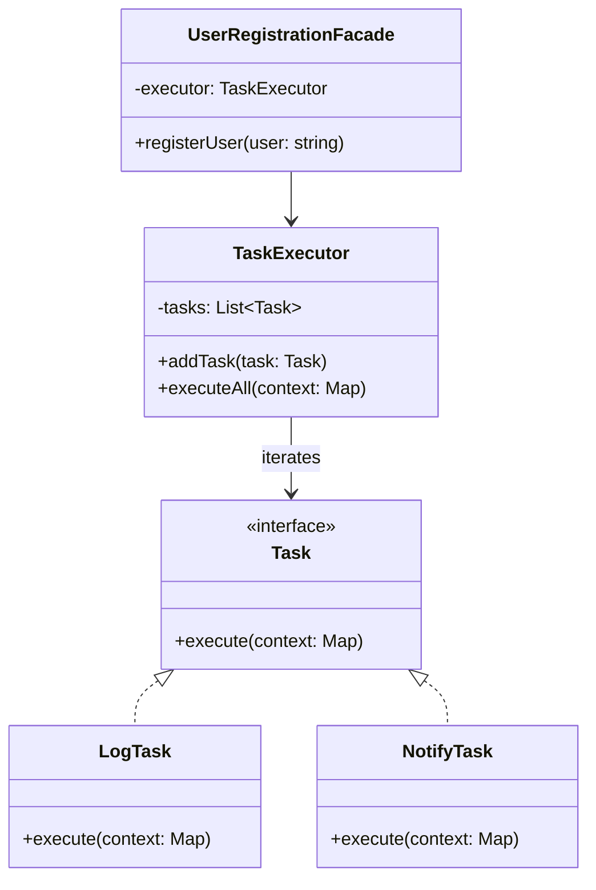

import Tabs from "@theme/Tabs";
import TabItem from "@theme/TabItem";
import CodeBlock from "@theme/CodeBlock";

import tsCode from "@site/src/codes/ref-synergy/ts/facade-iterator.ts";
import phpCode from "@site/src/codes/ref-synergy/php/facade-iterator.php";
import pyCode from "@site/src/codes/ref-synergy/py/facade-iterator.py";

# 🧩 Facade × Iterator

## ✅ Combined Intent

- Use the `Facade` pattern to provide a **simple entry point** to a multi-step operation
- Use the `Iterator` pattern to **sequentially execute a list of tasks** inside the facade

This design consolidates complex operations (like logging, user notification, validation, etc.) behind a single façade method, while internally iterating over a collection of modular tasks.

## ✅ When to Use

- You want to **simplify the interface** for a multi-step workflow
- You want to **modularize each step** (logging, validation, notification) and reuse or reorder them easily
- You need to maintain a **consistent structure** for running operations in sequence

## ✅ UML Class Diagram

## ✅ Code Example

<Tabs groupId="language">
  <TabItem value="ts" label="TypeScript">
    <CodeBlock language="ts">{tsCode}</CodeBlock>
  </TabItem>
  <TabItem value="php" label="PHP">
    <CodeBlock language="php">{phpCode}</CodeBlock>
  </TabItem>
  <TabItem value="python" label="Python">
    <CodeBlock language="python">{pyCode}</CodeBlock>
  </TabItem>
</Tabs>

## ✅ Explanation

- `UserRegistrationFacade` exposes a simple `registerUser()` method to clients
- Internally, it uses `TaskExecutor` to iterate through a list of tasks implementing a shared `Task` interface
- New tasks (e.g., logging, sending notifications) can be added without modifying the facade logic

This combination provides **high cohesion and low coupling**, improving reusability, readability, and testability.

## ✅ Summary

- **Facade** offers a simplified interface for complex operations
- **Iterator** modularizes and sequences operations step-by-step
- Perfect for workflows that need to be simple on the outside but flexible and extensible on the inside
