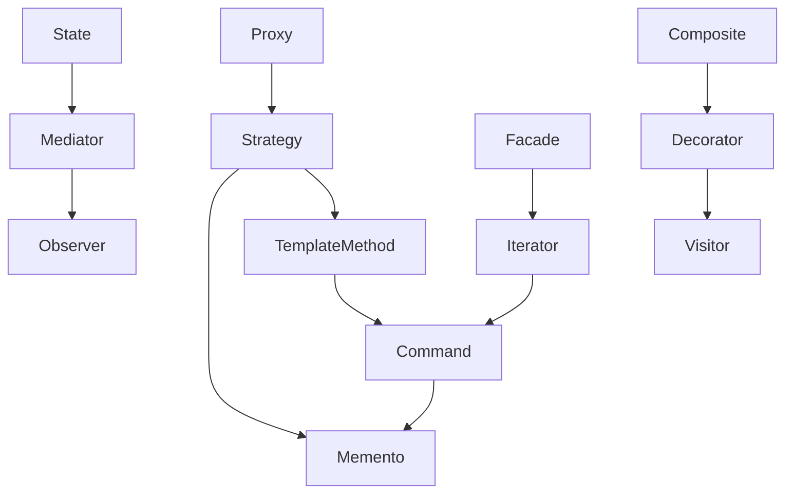

# Appendix: Extended Composition with 3 or More Patterns

While this document primarily focuses on **combinations of two design patterns**, in practice it is not uncommon to find **larger compositions where multiple patterns are layered to solve complex design needs**.

This appendix presents several representative examples of **three or more design patterns working together**, along with a visual map to help understand the structural evolution and relationship between them.

## ✅ Purpose and Overview

- Combinations of three or more patterns often emerge as **natural extensions of two-pattern compositions**.
- Each pattern in the chain **plays an independent yet complementary role**.
- This section helps provide **a bird’s-eye view of pattern expansion paths**, building on the main chapter’s examples.

## ✅ Pattern Relationship Graph

The following diagram illustrates **the common evolution paths** from one pattern to another.  
Each arrow (`→`) indicates that **a higher-level pattern can naturally build upon the preceding one**.

## ✅ Representative Pattern Stacks

| Composition                                      | Description                                                                                                                                                                                                      |
| ------------------------------------------------ | ---------------------------------------------------------------------------------------------------------------------------------------------------------------------------------------------------------------- |
| `Strategy → Template Method → Command → Memento` | A layered structure where dynamic behaviors (Strategy) are wrapped in a shared process flow (Template Method), transformed into executable commands (Command), and tracked with undo/redo capabilities (Memento) |
| `Proxy → Strategy → Memento`                     | A middleware layer combining access control (Proxy), dynamic execution paths (Strategy), and state preservation (Memento)                                                                                        |
| `State → Mediator → Observer`                    | A decoupled architecture where behavior changes with state (State), coordinated through a central mediator (Mediator), and observed via a publish-subscribe mechanism (Observer)                                 |
| `Facade → Iterator → Command`                    | A streamlined interface (Facade) backed by internal iteration (Iterator) and encapsulated executable operations (Command)                                                                                        |

## ✅ How to Use This Section

- This appendix offers **a structural summary of extended compositions**, rather than deep-dive implementation examples.
- While all detailed pages in this document focus on **two-pattern combinations**, these diagrams provide **structural context** for how larger patterns evolve.
- In real-world applications, **three-pattern compositions often grow organically from a two-pattern base**, once further flexibility or scalability is needed.

## ✅ Summary

- Multi-pattern structures involving three or more patterns are best understood as **extensions of two-pattern compositions**.
- This document is structured to **equip readers with the foundational understanding** of two-pattern usage, from which these larger structures can emerge.
- The diagram in this appendix serves as a **visual reference** for identifying natural paths of pattern expansion.
