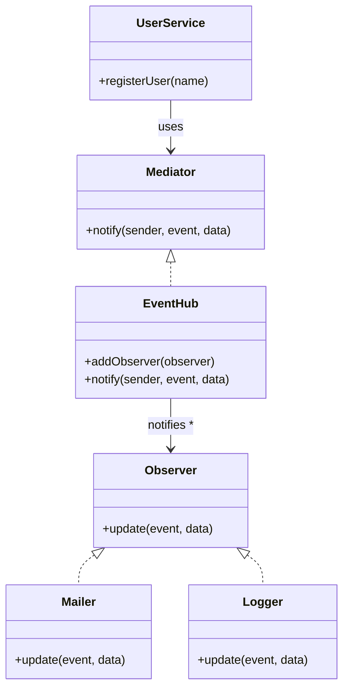

import Tabs from "@theme/Tabs";
import TabItem from "@theme/TabItem";
import CodeBlock from "@theme/CodeBlock";

import tsCode from "@site/src/codes/ref-synergy/ts/observer-mediator.ts";
import phpCode from "@site/src/codes/ref-synergy/php/observer-mediator.php";
import pyCode from "@site/src/codes/ref-synergy/py/observer-mediator.py";

# 🧩 Observer × Mediator

## ✅ Combination Intent

- Use `Observer` to decouple event emitters from event listeners
- Use `Mediator` to centralize control over notification flow

This combination allows you to emit events without knowing who will respond, manage notification targets in one place, and dynamically add/remove observers without modifying the source.

## ✅ Common Use Cases

- When you need to perform multiple actions (e.g., email, logging, Slack notifications) after user registration or form submission
- When the post-processing steps may change or increase in the future
- When decoupling the sender and listeners improves testability and flexibility

## ✅ UML Class Diagram

## ✅ Code Example

<Tabs groupId="language">
  <TabItem value="ts" label="TypeScript">
    <CodeBlock language="ts">{tsCode}</CodeBlock>
  </TabItem>
  <TabItem value="php" label="PHP">
    <CodeBlock language="php">{phpCode}</CodeBlock>
  </TabItem>
  <TabItem value="python" label="Python">
    <CodeBlock language="python">{pyCode}</CodeBlock>
  </TabItem>
</Tabs>

## ✅ Explanation

- `Observer` defines the `update()` method that responds to events
- `Mediator` (via `EventHub`) manages how events are broadcast to observers
- `UserService` only calls `notify()` on the mediator, unaware of the actual event handlers
- `Mailer` and `Logger` are `Observer` implementations that respond independently to events

This design enables **loose coupling** between emitters and listeners, while also allowing **centralized and transparent control** of notification behavior.

## ✅ Summary

- `Observer` enables **event-driven design with flexible listeners**
- `Mediator` centralizes **event flow and observer management**
- Ideal for event-driven systems that require **scalability, testability, and modular post-processing**
