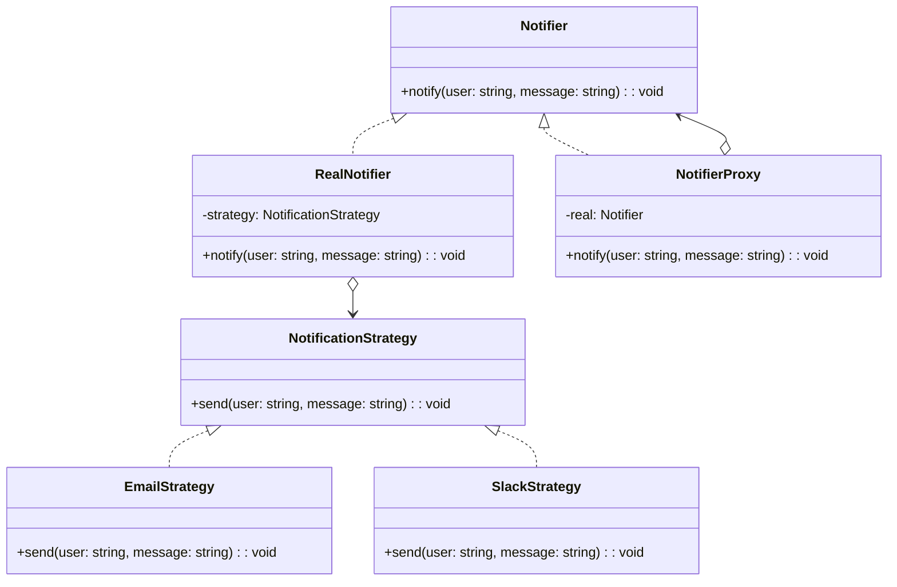

import Tabs from "@theme/Tabs";
import TabItem from "@theme/TabItem";
import CodeBlock from "@theme/CodeBlock";

import tsCode from "@site/src/codes/ref-synergy/ts/proxy-strategy.ts";
import phpCode from "@site/src/codes/ref-synergy/php/proxy-strategy.php";
import pyCode from "@site/src/codes/ref-synergy/py/proxy-strategy.py";

# 🧩 Proxy × Strategy

## ✅ Intent of the Combination

- Use the `Proxy` pattern to **wrap notification processing with access control or logging**
- Use the `Strategy` pattern to separate and switch the actual **notification method** (email, Slack, etc.)

This combination allows you to **apply reusable pre/post logic (like logging, authentication, or throttling) via Proxy**, while keeping the actual notification logic flexible and interchangeable via Strategy.

## ✅ Common Use Cases

- You want a shared notification flow (e.g., logging, tracing) handled by a Proxy, while switching notification logic dynamically
- You need **different behaviors across environments** (e.g., email in production, mock notifications in development)
- You want to **apply cross-cutting control (auth, logging, rate limiting)** through a Proxy, while decoupling it from specific strategies

## ✅ UML Class Diagram

## ✅ Code Example

<Tabs groupId="language">
  <TabItem value="ts" label="TypeScript">
    <CodeBlock language="ts">{tsCode}</CodeBlock>
  </TabItem>
  <TabItem value="php" label="PHP">
    <CodeBlock language="php">{phpCode}</CodeBlock>
  </TabItem>
  <TabItem value="python" label="Python">
    <CodeBlock language="python">{pyCode}</CodeBlock>
  </TabItem>
</Tabs>

## ✅ Explanation

- `NotificationStrategy` defines a shared interface for notification methods
- `EmailStrategy` and `SlackStrategy` implement concrete notification behaviors
- `RealNotifier` is the actual sender, which uses a strategy injected at construction
- `NotifierProxy` wraps `RealNotifier` and adds logging or access control before/after forwarding calls

This structure **decouples variable logic (strategy) from common control logic (proxy)** — resulting in cleaner, reusable, and flexible notification architecture.

## ✅ Summary

- **Proxy** provides centralized control like logging, authentication, or monitoring
- **Strategy** encapsulates swappable behaviors like email, Slack, or mocks
- By combining both, you achieve **flexibility and modularity** while maintaining **separation of concerns**
