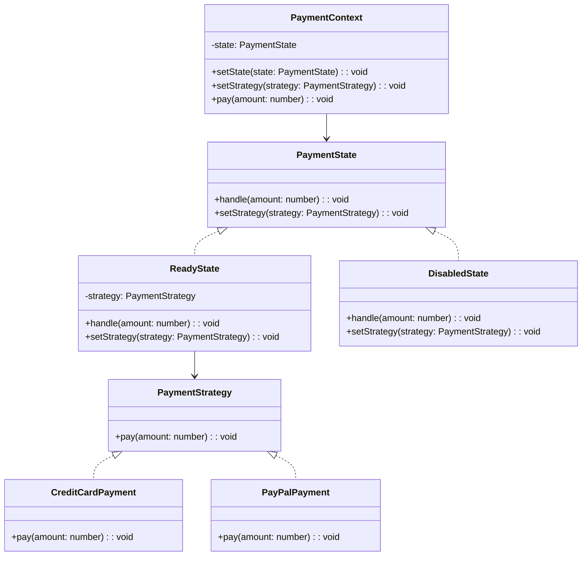

import Tabs from "@theme/Tabs";
import TabItem from "@theme/TabItem";
import CodeBlock from "@theme/CodeBlock";

import tsCode from "@site/src/codes/ref-synergy/ts/state-strategy.ts";
import phpCode from "@site/src/codes/ref-synergy/php/state-strategy.php";
import pyCode from "@site/src/codes/ref-synergy/py/state-strategy.py";

# 🧩 State × Strategy

## ✅ Combination Intent

- Use the `State` pattern to switch behavior based on the current state
- Use the `Strategy` pattern to flexibly change _how_ the behavior is executed

This combination allows separation and flexibility across **both state transitions** and **execution strategy**.

## ✅ Common Use Cases

- When behavior changes depending on the current state _and_ the algorithm (strategy) used
- For example, "Can payment be processed?" + "How should it be processed?"
- Useful in: payment flows, feature gating by user membership level, reservation logic, etc.

## ✅ UML Class Diagram

## ✅ Code Example

<Tabs groupId="language">
  <TabItem value="ts" label="TypeScript">
    <CodeBlock language="ts">{tsCode}</CodeBlock>
  </TabItem>
  <TabItem value="php" label="PHP">
    <CodeBlock language="php">{phpCode}</CodeBlock>
  </TabItem>
  <TabItem value="python" label="Python">
    <CodeBlock language="python">{pyCode}</CodeBlock>
  </TabItem>
</Tabs>

## ✅ Explanation

- `PaymentContext` holds a reference to the current state (`PaymentState`) and delegates logic
- `ReadyState` and `DisabledState` implement state-specific behavior via `handle()`
- The `Strategy` (e.g., `CreditCardPayment`, `PayPalPayment`) handles the actual processing logic
- Execution flow:
  - In `ReadyState`, the context allows the strategy to run
  - In `DisabledState`, the operation is blocked

## ✅ Summary

- **State pattern** clearly separates logic based on the object’s state
- **Strategy pattern** allows for flexible substitution of processing logic
- The architecture supports high extensibility and maintainability, as each axis (state and strategy) is decoupled and independently swappable
