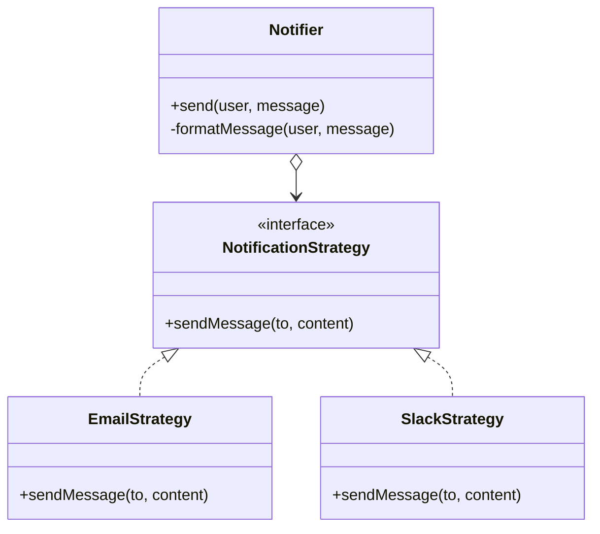

import Tabs from "@theme/Tabs";
import TabItem from "@theme/TabItem";
import CodeBlock from "@theme/CodeBlock";

import tsCode from "@site/src/codes/ref-synergy/ts/strategy-template.ts";
import phpCode from "@site/src/codes/ref-synergy/php/strategy-template.php";
import pyCode from "@site/src/codes/ref-synergy/py/strategy-template.py";

# 🧩 Strategy × Template Method

## ✅ Combined Intent

- Use `Template Method` to define the fixed flow of a notification process
- Delegate the variable part—the delivery method—to a `Strategy`

This design centralizes a shared notification flow (e.g., logging, message formatting, pre/post-processing), while allowing the delivery mechanism (email, Slack, etc.) to be easily swapped through strategy injection.

## ✅ Common Use Cases

- When the overall process is consistent (e.g., logging or validation), but the way messages are delivered or formatted needs to be flexible
- When you want to send real emails in production but use mock notifications in testing
- When you want to reuse formatting logic or logging behavior across different types of notifications

## ✅ UML Class Diagram

## ✅ Code Example

<Tabs groupId="language">
  <TabItem value="ts" label="TypeScript">
    <CodeBlock language="ts">{tsCode}</CodeBlock>
  </TabItem>
  <TabItem value="php" label="PHP">
    <CodeBlock language="php">{phpCode}</CodeBlock>
  </TabItem>
  <TabItem value="python" label="Python">
    <CodeBlock language="python">{pyCode}</CodeBlock>
  </TabItem>
</Tabs>

## ✅ Explanation

- `Notifier` provides the shared template (logging, formatting, dispatching)
- `formatMessage` is left abstract for subclasses like `AlertNotifier` to implement (Template Method)
- The delivery strategy (`EmailStrategy`, `SlackStrategy`) is injected, allowing dynamic switching (Strategy)

By **fixing the overall process with a template and externalizing variable behavior as strategies**, this design achieves both consistency and flexibility.

## ✅ Summary

- **Template Method** enforces a consistent flow for notifications
- **Strategy** decouples and enables flexible delivery behavior
- The design is extensible, testable, reusable, and easy to maintain
