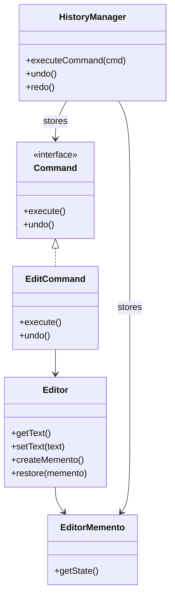

# 🧪️ Need to Implement Undo/Redo

## ✅ Problem Overview

In applications such as forms, editors, or GUIs, users often expect "Undo" and "Redo" functionality.  
However, implementing these features ad hoc can lead to scattered logic, manual state tracking, and brittle code.

Common challenges include:

- No centralized history of operations
- Asymmetrical or inconsistent undo/redo behavior
- Mixed responsibilities between actions and state transitions, making the code hard to test and extend

## ✅ Solution Overview

Use the `Command` pattern to represent operations as objects and  
use the `Memento` pattern to take snapshots of the system's state for recovery.

| Concern                        | Applied Pattern |
| ------------------------------ | --------------- |
| Capturing and managing actions | Command         |
| Saving and restoring state     | Memento         |

By separating "what happened" from "what changed", the system can maintain a clear and consistent undo/redo mechanism.

## ✅ Pattern Synergy

| Role                        | Example Implementation           |
| --------------------------- | -------------------------------- |
| Executable/undoable action  | `EditCommand`, `InsertCommand`   |
| Captured state              | `EditorMemento`                  |
| State owner                 | `Editor` (Originator of Memento) |
| Command and history manager | `HistoryManager` (Invoker)       |

Each command triggers a `Memento` snapshot before modifying the state.  
The `HistoryManager` tracks both the actions and the corresponding states to perform undo/redo operations.

## ✅ UML Class Diagram

## ✅ Explanation

This structure separates action execution from state management:

- Each operation is encapsulated as a `Command` object (`EditCommand`)
- The state is saved before the command executes via `Memento` (`EditorMemento`)
- `HistoryManager` stores both commands and mementos for history control

This architecture enables:

- Self-contained undo/redo behavior per command
- Decoupled logic between state and execution
- Centralized, testable history tracking

## ✅ Practical Notes

- ✅ Well-suited for editors, drawing apps, and any input-driven interface with revertibility
- ✅ Also applicable for transaction control, multi-step form navigation, or timeline-based editing
- ✅ Command and Memento decouple responsibilities, simplifying testing and rollback logic

## ✅ Summary

- Use `Command` to encapsulate operations and store execution history
- Use `Memento` to snapshot and restore application state
- Together, they provide a structured and reliable way to implement undo/redo
- Enhances UX and developer confidence through clear, reversible logic

This design ensures flexibility and robustness in scenarios where precise user operation tracking and recovery are required.
