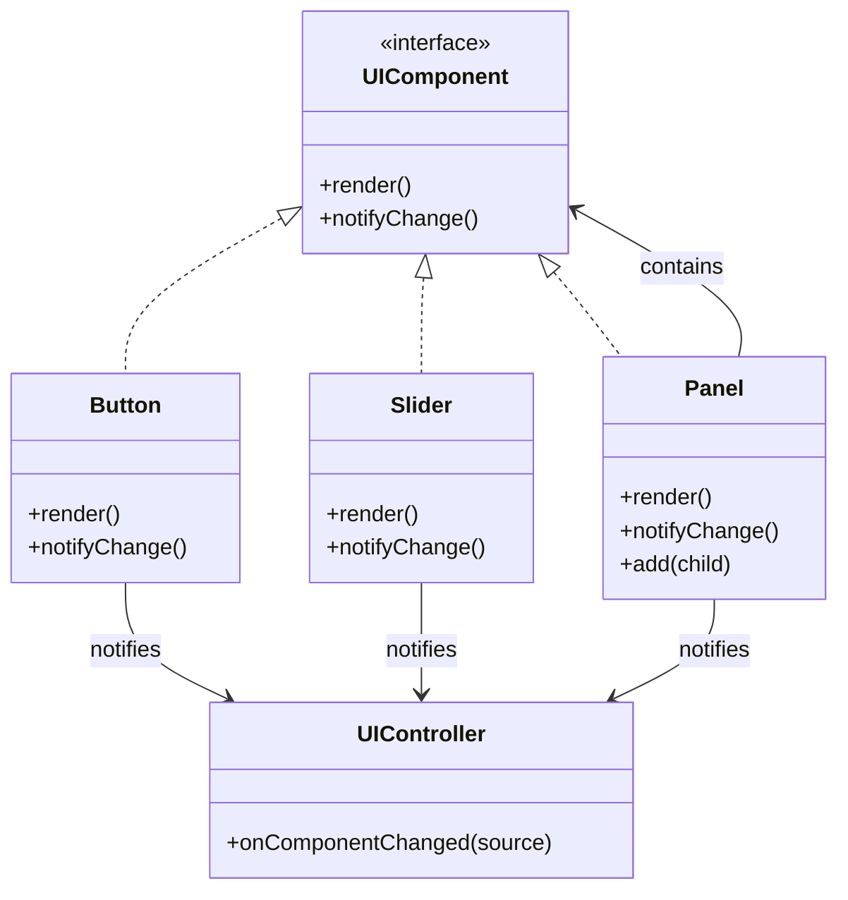

# 🧪️ Coordinating UI Components is Messy

## ✅ Problem Overview

Modern UIs like dashboards or settings panels often consist of many interdependent components.  
When each component communicates directly with others, the logic becomes tangled and difficult to maintain.

Common issues include:

- Child components directly modifying each other’s state
- Growing complexity as the UI layout increases
- No centralized controller to track interactions, making behavior hard to trace

## ✅ Solution Overview

Use the `Composite` pattern to treat the UI as a tree of components,  
and apply the `Mediator` pattern to centralize control and coordination logic.

| Concern                         | Applied Pattern |
| ------------------------------- | --------------- |
| Managing hierarchical structure | Composite       |
| Coordinating components         | Mediator        |

This design decouples the structural layout from the communication logic, improving maintainability.

## ✅ Pattern Synergy

| Role                | Example Implementation          |
| ------------------- | ------------------------------- |
| UI base component   | `UIComponent` (interface)       |
| Leaf elements       | `Button`, `Slider` (Leaf)       |
| Container elements  | `Panel`, `GroupBox` (Composite) |
| Mediator/controller | `UIController` (Mediator)       |

- Each component implements a unified interface and can be nested (Composite)
- Communication and notifications are handled by a centralized `UIController` (Mediator)

## ✅ UML Class Diagram

## ✅ Explanation

This structure separates structural concerns from coordination:

- `UIComponent` defines the shared interface (Composite)
- Elements like `Button`, `Slider`, and `Panel` form a nested UI tree
- `UIController` acts as a central point of communication (Mediator)

This allows each component to operate independently while remaining part of a coordinated system.

## ✅ Practical Notes

- ✅ Suitable for dashboards, settings pages, and complex forms with interconnected components
- ✅ Makes interaction logic easier to trace and update
- ✅ Helps prevent tight coupling between individual elements

Examples:

- Forms with validation messages and live previews
- UI controls that enable/disable others dynamically
- Multi-pane interfaces with linked behaviors and selections

## ✅ Summary

- `Composite` builds a flexible, tree-based UI structure
- `Mediator` centralizes event handling and inter-component communication
- The design cleanly separates UI layout from coordination logic
- Components remain independently testable and reusable

In complex interfaces with many moving parts, this pattern combination offers a clear structure and centralized control that scales effectively.
