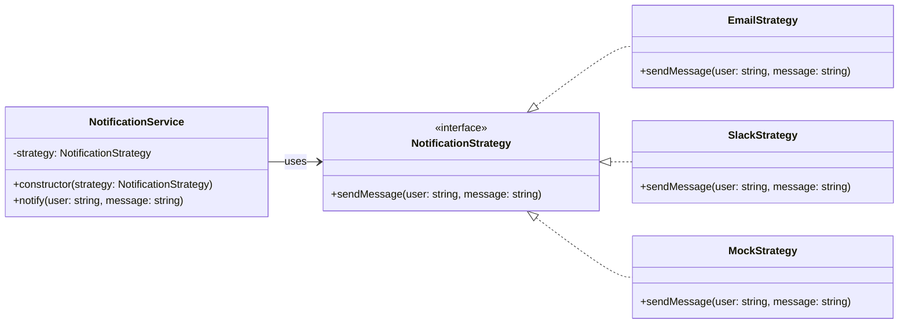

# 🧪 Hard to Test

## ✅ Problem

Business logic that directly contains side effects such as notifications becomes difficult to test.  
For example, if `OrderService` internally sends an email or Slack message, it’s hard to verify the behavior in tests without actually triggering those notifications.

This often leads to the following issues:

- Unable to suppress side effects like email sending during tests
- Difficult to verify whether a notification was _intended_ to be sent
- Hard to swap the notification method depending on the environment

This is a typical anti-pattern where **hardcoded dependencies hinder testability and flexibility**.

## ✅ Solution Overview

To resolve this, the notification behavior is extracted using the **Strategy Pattern**, and its implementation is injected through **Dependency Injection (DI)**.

| Concern                              | Design Pattern Applied |
| ------------------------------------ | ---------------------- |
| Making notification method swappable | Strategy               |
| Avoiding hardcoded instantiation     | Dependency Injection   |

This combination allows the notification logic to be replaced with mocks during testing, or configured for real usage in production—**without modifying the business logic**.

## ✅ Pattern Synergy

| Role                  | Implementation                   |
| --------------------- | -------------------------------- |
| Interface abstraction | `NotificationStrategy`           |
| Real behaviors        | `EmailStrategy`, `SlackStrategy` |
| Test stub             | `MockStrategy`                   |
| Behavior injection    | Constructor DI                   |

This approach allows business logic to operate independently of the actual notification mechanism, and makes testing much easier and safer.

## ✅ UML Class Diagram

## ✅ Explanation

In this design, the notification mechanism is injected into the `NotificationService` constructor.  
The `NotificationStrategy` interface provides a consistent contract, allowing real implementations (email, Slack) and mocks to be swapped as needed.

This design ensures that:

- The business logic remains agnostic of how messages are sent
- Mocks can be injected during unit tests to isolate behavior
- Environment-specific behavior can be configured at runtime

## ✅ Practical Benefits and Usage Scenarios

- ✅ Business logic can be tested without triggering real notifications
- ✅ Behavior can be swapped dynamically in development vs production environments
- ✅ Debugging and logging of notifications can be added without changing core logic

Common scenarios include notification systems, payment gateways, or any logic that interacts with external services.

## ✅ Summary

- **Strategy Pattern** encapsulates interchangeable notification behavior
- **Dependency Injection** decouples creation from usage, enabling testing flexibility
- Together, they enable high testability and clean separation of concerns

This pattern combination is highly effective for writing testable, maintainable business logic that interacts with external systems.
