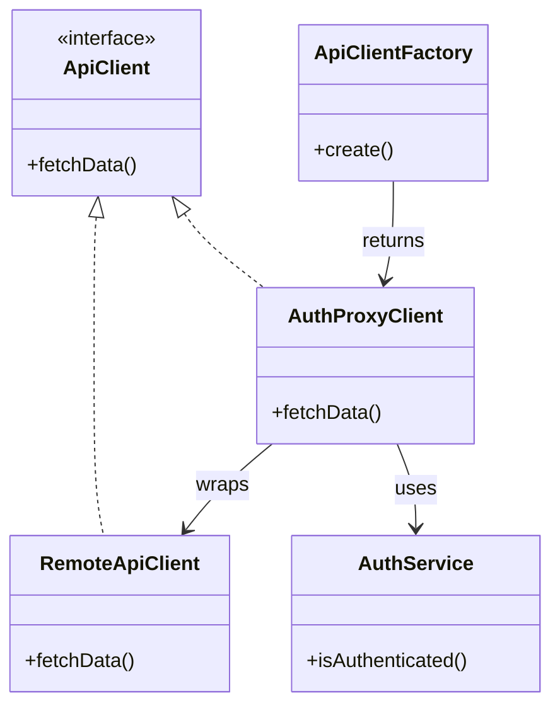

# 🧪️ Need to Generate Authenticated Resources

## ✅ Problem Overview

When accessing external APIs or protected resources, handling authentication, token validation, and client setup often becomes tangled.  
Distributing authentication checks across the codebase leads to poor maintainability and low reusability.

Common issues include:

- Repeated authentication logic scattered across modules
- Tight coupling between authentication and resource creation
- Difficult-to-test code due to embedded conditional authentication logic

## ✅ Solution Overview

Use the `Factory` pattern to centralize and encapsulate resource creation,  
and apply the `Proxy` pattern to add authentication logic transparently when accessing those resources.

| Concern                        | Applied Pattern |
| ------------------------------ | --------------- |
| Resource creation and wiring   | Factory         |
| Authorization and access check | Proxy           |

## ✅ Pattern Synergy

| Role                   | Example Implementation |
| ---------------------- | ---------------------- |
| Actual resource        | `RemoteApiClient`      |
| Authentication wrapper | `AuthProxyClient`      |
| Resource factory       | `ApiClientFactory`     |
| Auth logic             | `AuthService`          |

- The `Proxy` adds authentication checks before each call.
- The `Factory` hides the complexity and delivers ready-to-use, secured resources.

## ✅ UML Class Diagram

## ✅ Explanation

This structure separates concerns clearly:

- `RemoteApiClient` handles the real external API communication.
- `AuthProxyClient` wraps the client and performs authentication before delegation (`Proxy`).
- `ApiClientFactory` encapsulates the setup and returns a ready-to-use secured instance (`Factory`).
- `AuthService` evaluates authentication status.

Clients simply request a secured resource from the factory without needing to manage access logic themselves.

## ✅ Practical Notes

- ✅ Enables shared, centralized authentication logic for all API calls
- ✅ Easily testable via mockable proxies without actual authentication
- ✅ Factory swapping allows switching between development and production environments safely

Examples:

- OAuth-protected API clients
- Admin UIs gated by role-based access
- Plugin frameworks accessing secure external services

## ✅ Summary

- Use `Factory` to encapsulate resource creation including security logic
- Use `Proxy` to enforce authentication checks transparently
- Promotes maintainability and security by cleanly separating concerns
- Ideal for creating secure, reusable access layers for protected resources

This design pattern combination is particularly effective for external integrations where security, configurability, and reusability are key architectural priorities.
