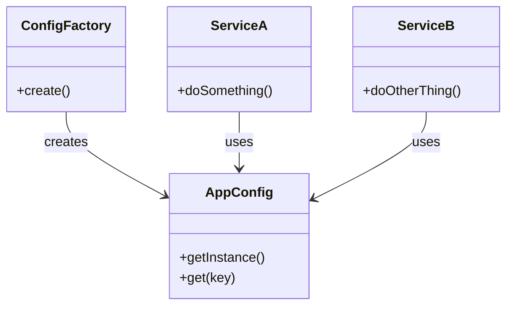

# 🧪️ Configuration Is Scattered

## ✅ Problem Overview

When an application grows, configuration and dependency initialization often become scattered, duplicated, or inconsistent.  
Manually wiring values in multiple places leads to tight coupling and reduced flexibility.

Common issues include:

- Initialization logic is duplicated and difficult to manage
- Inconsistent configuration handling across modules
- Hard to switch environments between test/staging/production

## ✅ Solution Overview

Use the `Factory` pattern to centralize configuration creation,  
and the `Singleton` pattern to ensure consistent reuse of that configuration across the system.

| Concern                        | Applied Pattern |
| ------------------------------ | --------------- |
| Centralized configuration init | Factory         |
| Shared access to instances     | Singleton       |

## ✅ Pattern Synergy

| Role                 | Example Implementation        |
| -------------------- | ----------------------------- |
| Configuration source | `ConfigFactory` (initializer) |
| Shared instance      | `AppConfig` (singleton)       |
| Consumers            | `ServiceA`, `ServiceB`        |

- `Factory` creates a single, consistent configuration structure
- `Singleton` ensures shared access and avoids redundant instantiation

## ✅ UML Class Diagram

## ✅ Explanation

This design separates configuration concerns from usage:

- `ConfigFactory` encapsulates how configuration is created and loaded (Factory)
- `AppConfig` is created once and shared system-wide (Singleton)
- Services depend only on the `AppConfig` interface, not the creation logic

This enables clean initialization and easier testing or replacement.

## ✅ Practical Notes

- ✅ Environment switching (dev/staging/prod) becomes easier
- ✅ Configuration can be mocked or overridden in test contexts
- ✅ Also applicable to shared resources like DB connections or auth providers

Examples:

- Wrapping `.env` loading into a single `AppConfig` class
- Injecting mock `ConfigFactory` in unit tests
- Managing shared configuration for internal libraries and services

## ✅ Summary

- Use `Factory` to centralize configuration creation logic
- Use `Singleton` to maintain a consistent, shared config instance
- Greatly improves clarity and maintainability of application setup
- Enables safe, flexible environment switching and testability

This design provides a robust foundation for scalable and reliable configuration management.
