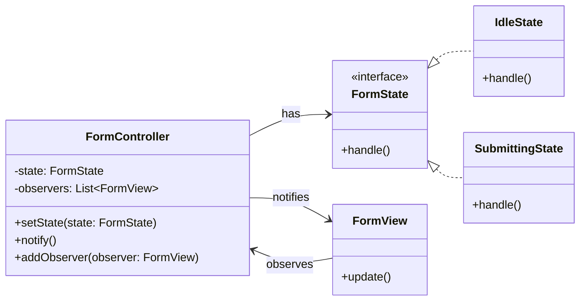

# 🧪️ UI State Management is Too Complex

## ✅ Problem Overview

In many UI implementations, the display and behavior change based on application state.  
As conditions like “if this flag is true, show the button” or “show loading while submitting” increase, **UI logic tends to become scattered**, which makes the code difficult to read, maintain, and test.

This often leads to:

- Conditional rendering logic embedded deeply inside components
- Difficulty in tracking when and how state changes occur
- Lack of consistent patterns in handling UI updates

## ✅ Solution Overview

Separate state behavior using the `State` pattern and notify UI components of state changes via the `Observer` pattern.

| Concern                              | Design Pattern Applied |
| ------------------------------------ | ---------------------- |
| Behavior switching based on state    | State                  |
| Broadcasting state changes to the UI | Observer               |

This approach separates state control and UI rendering, leading to a more scalable and maintainable structure.

## ✅ Pattern Synergy

| Role                 | Implementation Example               |
| -------------------- | ------------------------------------ |
| State holder         | `FormState` (State interface)        |
| Concrete states      | `IdleState`, `SubmittingState`, etc. |
| State change trigger | `FormController` (Subject)           |
| UI renderer          | `FormView` (Observer)                |

The `State` pattern manages state-specific logic,  
while `Observer` enables reactive UI updates in response to state transitions—ensuring **clarity and flexibility in UI behavior**.

## ✅ UML Class Diagram

## ✅ Explanation

In this design, state transitions like "idle" or "submitting" are encapsulated in `FormState` and its concrete implementations.  
The `FormController` handles state switching and notifies `FormView` instances to reflect changes.

This results in:

- Clear separation of behavior per state
- Automatic UI updates triggered by state transitions
- Less coupling between state logic and UI rendering

Ultimately, the design helps manage complexity while enabling clean stateful UI behavior.

## ✅ Practical Benefits and Use Cases

- ✅ Easy to extend with new UI states
- ✅ Reduces conditional rendering logic in views
- ✅ Makes UI predictable and testable across states

Ideal for forms, dashboards, multi-step wizards, modals—**any interface where UI varies depending on current state**.

## ✅ Summary

- `State` cleanly encapsulates behavior per state class
- `Observer` enables efficient and decoupled UI updates
- Together, they provide a highly maintainable and scalable UI update system

This pattern combination greatly enhances clarity, reliability, and flexibility in UI-driven applications.
