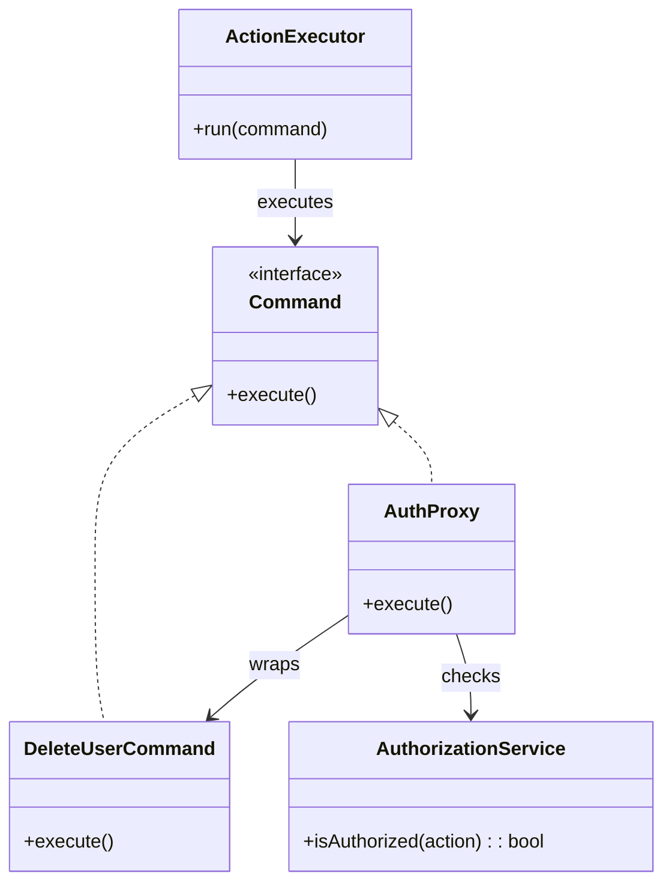

# 🧪️ Need Conditional Execution with Auth

## ✅ Problem Overview

In many systems, certain operations—like deleting records or triggering external API calls—must be executed only if the user is authorized.  
However, when business logic and authorization logic are mixed together, the code becomes tightly coupled, hard to test, and difficult to extend.

Common challenges:

- Authorization checks are hardcoded into each operation
- Execution logic is tangled with access control rules
- Adding new roles or permission conditions leads to growing complexity and duplication

## ✅ Solution Overview

Apply the `Command` pattern to encapsulate operations as objects,  
and wrap them with a `Proxy` that performs permission checks before execution.

| Concern                          | Applied Pattern |
| -------------------------------- | --------------- |
| Encapsulating operations         | Command         |
| Conditional execution and access | Proxy           |

## ✅ Pattern Synergy

| Role                   | Example Implementation        |
| ---------------------- | ----------------------------- |
| Operation logic        | `DeleteUserCommand` (Command) |
| Authorization wrapper  | `AuthProxy` (Proxy)           |
| Execution controller   | `ActionExecutor` (Invoker)    |
| Authorization provider | `AuthorizationService`        |

- `Command` turns operations into reusable, executable objects
- `Proxy` intercepts the call and enforces access rules before delegation

## ✅ UML Class Diagram

## ✅ Explanation

This structure separates authorization from business logic:

- `DeleteUserCommand` encapsulates the action logic
- `AuthProxy` wraps the command and performs an access check before execution
- `AuthorizationService` provides centralized authorization rules
- `ActionExecutor` invokes any `Command`, unaware of whether it's a proxy or not

By cleanly separating concerns, the design supports reuse, testability, and clear responsibility boundaries.

## ✅ Practical Notes

- ✅ Enables flexible authorization wrapping for any command-like operation
- ✅ Multiple access strategies (admin-only, self-only) can be swapped via the proxy layer
- ✅ Can be combined with logging, UI button visibility, or audit tracking

Examples:

- Admin-only delete or approval actions
- Role-based control of features like user group editing
- Pre-validated API calls that should execute only under certain business rules

## ✅ Summary

- Use `Command` to encapsulate operations for reuse and tracking
- Use `Proxy` to add access control and validation before execution
- A powerful combination for conditionally executing actions securely
- Helps unify concerns like authorization, logging, and execution control

This pattern synergy provides a highly maintainable and secure approach to managing protected operations in real-world systems.
