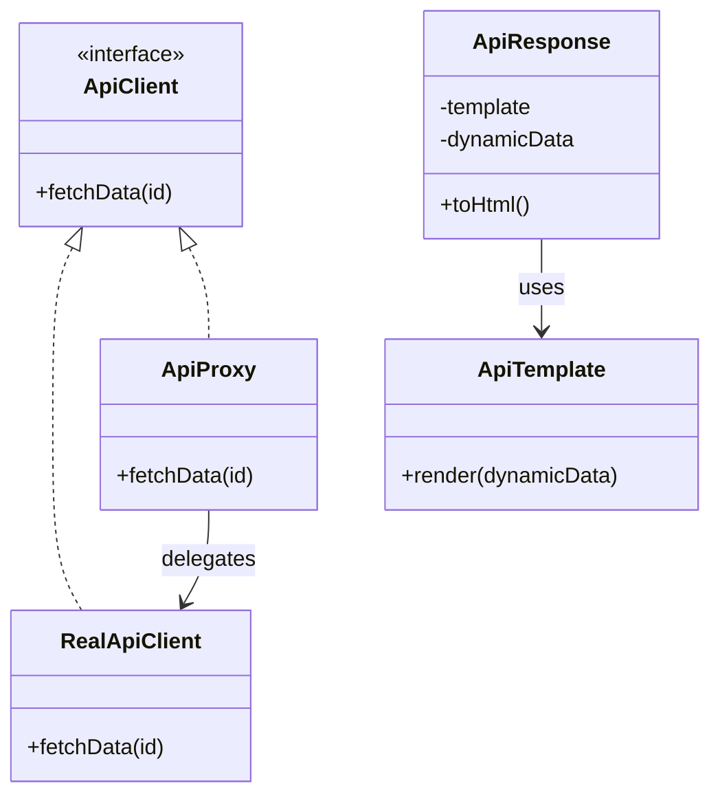

# 🧪️ API Calls Are Heavy and Slow

## ✅ Problem Overview

Communication with external APIs can significantly degrade system performance due to latency and waiting for responses.  
In many cases, the same data is fetched repeatedly without any caching or reuse.

Common issues include:

- Repeated API calls resulting in poor performance
- Redundant fetching of reusable response data
- Complicated access logic scattered across the calling code, lacking central control

## ✅ Solution Overview

Introduce a caching proxy layer using the `Proxy` pattern to control and delay API access.  
Use the `Flyweight` pattern to share common structures like templates or rendering logic to reduce memory usage.

| Concern                   | Applied Pattern |
| ------------------------- | --------------- |
| Lazy evaluation & control | Proxy           |
| Shared structure reuse    | Flyweight       |

## ✅ Pattern Synergy

| Role              | Example Implementation             |
| ----------------- | ---------------------------------- |
| Actual API client | `RealApiClient`                    |
| Proxy layer       | `ApiProxy` (with caching)          |
| Shared structure  | `ApiTemplate` (immutable template) |
| Dynamic data      | `ApiResponse` (user-specific data) |

- `Proxy` enables request control and caching
- `Flyweight` allows shared structure reuse, improving resource efficiency

## ✅ UML Class Diagram

## ✅ Explanation

This design separates responsibilities clearly:

- `ApiProxy` handles request control and caching (Proxy)
- `RealApiClient` performs the actual API communication
- `ApiTemplate` retains the immutable shared structure (Flyweight)
- `ApiResponse` combines variable data with the template

By dividing access control and structure reuse across the respective patterns,  
the system enables flexible and efficient API interaction.

## ✅ Practical Notes

- ✅ Highly effective when fetching the same ID or resource repeatedly
- ✅ Ideal for shared response formats that use common templates or rendering rules
- ✅ Improves not only performance by reducing API calls but also UI reusability

Example use cases:

- Read-only APIs for profile or category data
- Common dashboard card layouts
- Template-based content delivery systems

## ✅ Summary

- Use `Proxy` to enable caching and lazy evaluation before API access
- Use `Flyweight` to share structure and reduce resource consumption
- A well-suited combination for scenarios with heavy API traffic
- Balances communication optimization and UI maintainability

Wrapping API access and sharing reusable structures through this design is  
**a powerful approach to maintain stability and scalability under high-load environments**.
