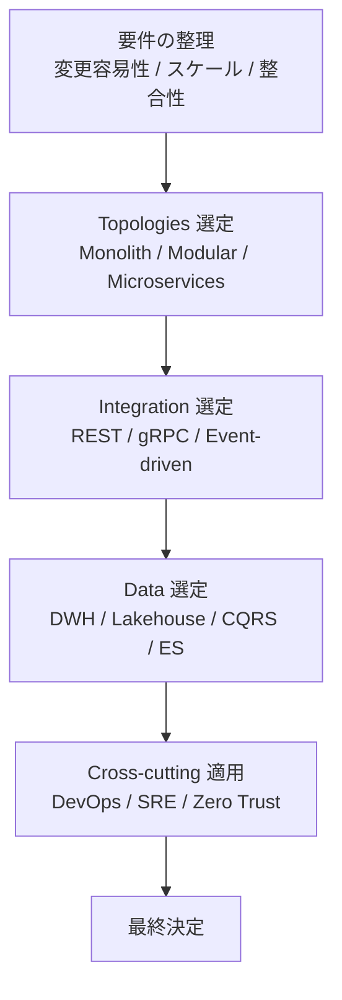

# 🧩 Architecture Decision Guide（アーキテクチャ選定ガイド）

ソフトウェアアーキテクチャは「流行」ではなく、**目的と制約に応じて選択する技術** である。本ガイドでは、どのスタイル・トップロジー・統合方式を選ぶべきかを判断するための観点を整理する。

## ✅ まず最初に判断すべき 3 つの軸

アーキテクチャ選定の核心は次の 3 軸である。

### 1. 変更容易性（Changeability）

- 変更頻度は高いか？
- 変更の影響範囲は広いか？
- ドメインルールの複雑さは大きいか？

→ 高い場合は **依存方向ルール（Clean / Hexagonal / Onion）** が有力。

### 2. スケール要求（Scalability）

- ユーザ数 / トラフィックは急増するか？
- 物理的にスケールさせる必要があるか？

→ 高い場合は **Microservices / Serverless / Edge** が候補。

### 3. データ整合性（Consistency）

- 強整合性が必須か？
- 遅延を許容できるか？

→ 最終的整合性を許容するなら **Event-driven / CQRS / Event Sourcing** が有効。

## ✅ Topologies 選定（Monolith / Modular Monolith / Microservices）

### ◎ Monolith を選ぶべきケース

- 初期フェーズ
- 小規模チーム
- 変更範囲が明確である

### ◎ Modular Monolith を選ぶべきケース

- チームが 2〜5 つ程度
- コンテキスト境界が明確
- 将来マイクロサービス化を視野に入れる

### ◎ Microservices を選ぶべきケース

- チーム規模が大きい
- 独立デプロイが強い要件
- 境界が明確でドメインが複雑

## ✅ Integration スタイル選定（REST / gRPC / Event-driven）

### REST

- 公開 API
- 使いやすさ重視
- 汎用的な Web システム

### gRPC

- サービス間通信（高速・型安全）
- 内部 API
- パフォーマンス要求が高い

### Event-driven

- 疎結合化したい場合
- 非同期処理が中心
- レジリエンス要求が高い

## ✅ Data アーキテクチャ選定

### Data Warehouse

- 分析 BI
- 構造化データ中心

### Data Lake / Lakehouse

- 半構造化・非構造化データ
- ML パイプライン

### CQRS

- 読み書き負荷の偏り
- 読みモデルを最適化したい

### Event Sourcing

- 監査 / 履歴が必須
- 時系列データが中心

## ✅ Cross-cutting の観点から決める

### DevOps / CI/CD

- 部署横断でデプロイ頻度を高めたい

### SRE / SLO

- 可用性と信頼性を KPI として扱う必要がある

### Team Topologies

- 組織構造によりアーキテクチャは変化する（Conway’s Law）

## 🧭 最終的な選定フロー（簡易チャート）

## ✅ まとめ

アーキテクチャ選定とは、  
**「状況・要件・組織・制約」から逆算して構造を決めるプロセス** である。

特定のスタイルに固執するのではなく、  
**どの問題を解決するためにどの構造を選ぶのか** を明確にすることが重要である。
