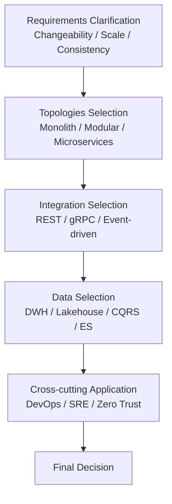

# 🌟 Architecture Decision Guide

Software architecture is not a "trend" but a **technology selected according to purpose and constraints**. This guide organizes perspectives for judging which style, topology, or integration method to choose.

## ✅ Three Axes to Decide First

The core of architecture selection lies in the following three axes:

### 1. Changeability

- Is the frequency of change high?
- Is the scope of change wide?
- Is the complexity of domain rules high?

→ If high, **[Dependency Rule](./structural/layered/dependency-rule-layered/index.md) ([Clean](./structural/layered/dependency-rule-layered/clean.md) / [Hexagonal](./structural/layered/dependency-rule-layered/hexagonal.md) / [Onion](./structural/layered/dependency-rule-layered/onion.md))** is a strong candidate.

### 2. Scalability Requirements

- Will the number of users/traffic increase rapidly?
- Is there a need to scale physically?

→ If high, **[Microservices](./topologies/microservices.md) / [Serverless](./topologies/serverless.md) / [Edge](./topologies/edge.md)** are candidates.

### 3. Data Consistency

- Is strong consistency mandatory?
- Can latency be tolerated?

→ If eventual consistency is acceptable, **[Event-driven](./integration/event-driven.md) / [CQRS](./data/cqrs.md) / [Event Sourcing](./data/event-sourcing.md)** are effective.

## ✅ Topologies Selection ([Monolith](./topologies/monolith.md) / [Modular Monolith](./topologies/modular-monolith.md) / [Microservices](./topologies/microservices.md))

### ◎ Case for Monolith

- Initial phase
- Small team
- Scope of change is clear

### ◎ Case for Modular Monolith

- Team size of about 2-5
- Context boundaries are clear
- Considering future migration to Microservices

### ◎ Case for Microservices

- Large team scale
- Independent deployment is a strong requirement
- Boundaries are clear and the domain is complex

## ✅ Integration Style Selection ([REST / gRPC](./integration/rest-grpc-graphql.md) / [Event-driven](./integration/event-driven.md))

### [REST](./integration/rest-grpc-graphql.md)

- Public API
- Ease of use prioritized
- General Web systems

### [gRPC](./integration/rest-grpc-graphql.md)

- Inter-service communication (High speed, Type safety)
- Internal API
- High performance requirements

### [Event-driven](./integration/event-driven.md)

- Want to decouple
- Asynchronous processing is central
- High resilience requirements

## ✅ Data Architecture Selection

### [Data Warehouse](./data/data-warehouse.md)

- Analytics BI
- Structured data centric

### [Data Lake / Lakehouse](./data/data-lake-lakehouse.md)

- Semi-structured / Unstructured data
- ML pipelines

### [CQRS](./data/cqrs.md)

- Bias in read/write load
- Want to optimize the read model

### [Event Sourcing](./data/event-sourcing.md)

- Audit / History is mandatory
- Time-series data is central

## ✅ Deciding from Cross-cutting Perspectives

### [DevOps / CI/CD](./cross-cutting/devops.md)

- Want to increase deployment frequency across departments

### [SRE / SLO](./cross-cutting/slo-sre.md)

- Need to treat availability and reliability as KPIs

### [Team Topologies](./cross-cutting/team-topologies.md)

- Architecture changes depending on organizational structure (Conway’s Law)

## 🧭 Final Selection Flow (Simplified Chart)

## ✅ Summary

Architecture selection is a **process of determining structure by calculating backward from "Situation, Requirements, Organization, Constraints".**

It is important not to stick to a specific style, but to clarify **which structure is chosen to solve which problem.**
