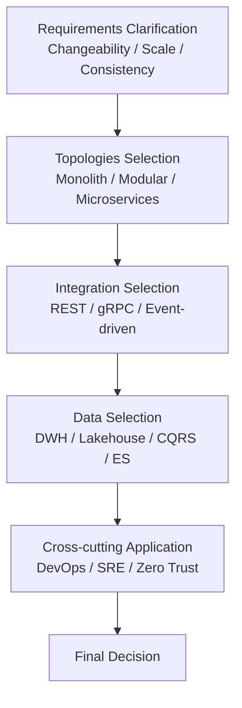

# 🧩 Architecture Decision Guide

Software architecture is not a "trend" but a **technology selected according to purpose and constraints**. This guide organizes perspectives for judging which style, topology, or integration method to choose.

## ✅ Three Axes to Decide First

The core of architecture selection lies in the following three axes:

### 1. Changeability

- Is the frequency of change high?
- Is the scope of change wide?
- Is the complexity of domain rules high?

→ If high, **Dependency Rule (Clean / Hexagonal / Onion)** is a strong candidate.

### 2. Scalability Requirements

- Will the number of users/traffic increase rapidly?
- Is there a need to scale physically?

→ If high, **Microservices / Serverless / Edge** are candidates.

### 3. Data Consistency

- Is strong consistency mandatory?
- Can latency be tolerated?

→ If eventual consistency is acceptable, **Event-driven / CQRS / Event Sourcing** are effective.

## ✅ Topologies Selection (Monolith / Modular Monolith / Microservices)

### ◎ Case for Monolith

- Initial phase
- Small team
- Scope of change is clear

### ◎ Case for Modular Monolith

- Team size of about 2-5
- Context boundaries are clear
- Considering future migration to Microservices

### ◎ Case for Microservices

- Large team scale
- Independent deployment is a strong requirement
- Boundaries are clear and the domain is complex

## ✅ Integration Style Selection (REST / gRPC / Event-driven)

### REST

- Public API
- Ease of use prioritized
- General Web systems

### gRPC

- Inter-service communication (High speed, Type safety)
- Internal API
- High performance requirements

### Event-driven

- Want to decouple
- Asynchronous processing is central
- High resilience requirements

## ✅ Data Architecture Selection

### Data Warehouse

- Analytics BI
- Structured data centric

### Data Lake / Lakehouse

- Semi-structured / Unstructured data
- ML pipelines

### CQRS

- Bias in read/write load
- Want to optimize the read model

### Event Sourcing

- Audit / History is mandatory
- Time-series data is central

## ✅ Deciding from Cross-cutting Perspectives

### DevOps / CI/CD

- Want to increase deployment frequency across departments

### SRE / SLO

- Need to treat availability and reliability as KPIs

### Team Topologies

- Architecture changes depending on organizational structure (Conway’s Law)

## 🧭 Final Selection Flow (Simplified Chart)

## ✅ Summary

Architecture selection is a **process of determining structure by calculating backward from "Situation, Requirements, Organization, Constraints".**

It is important not to stick to a specific style, but to clarify **which structure is chosen to solve which problem.**
