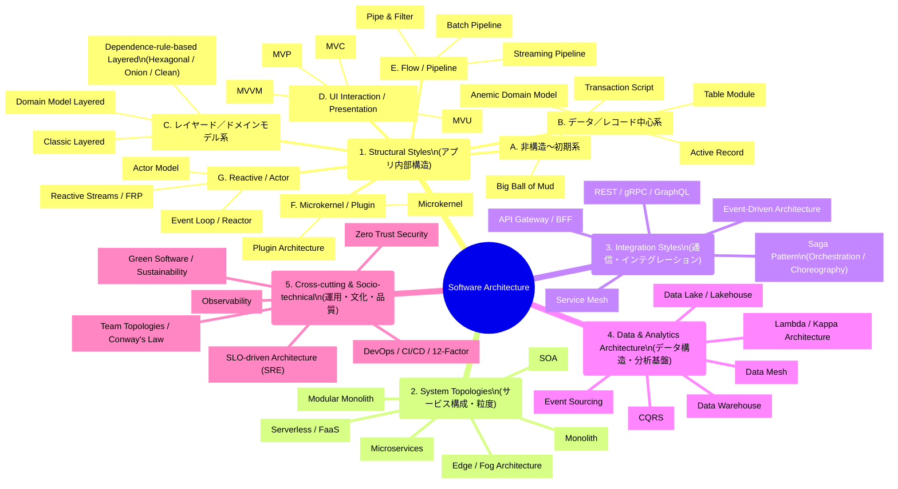
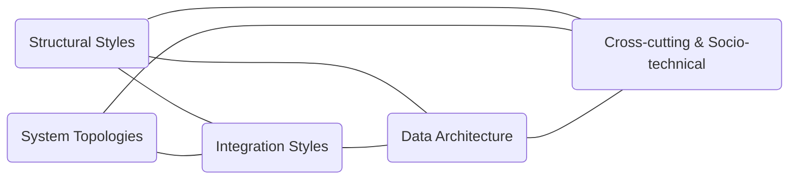

# ソフトウェアアーキテクチャの地図

このサイトは、ソフトウェアアーキテクチャを体系立てて理解するための “地図” を作ることを目的としています。

---

## なぜアーキテクチャは分かりにくいのか？

ソフトウェアアーキテクチャは、単一の概念ではありません。  
以下のような **異なる階層の設計が同時に語られる** ため、多くの人が混乱します。

- アプリケーション内部構造（レイヤード、MVC、Hexagonal…）
- システム構成／粒度（モノリス、マイクロサービス…）
- 通信方式（REST、gRPC、Event-Driven…）
- データ構造／基盤（Data Lake、CQRS、Event Sourcing…）
- 運用・組織（DevOps、Team Topologies、SRE…）

これらは**構造・配置・通信・データ・運用**というまったく異なる設計レイヤーであり、
1 つの図や 1 つの概念で説明できるものではありません。

---

## この分類構成について（歴史的背景とバランス）

本サイトにおける **Structural Styles（アプリ内部構造）** は、  
他のカテゴリより細かく分類されています。これは、近年のアーキテクチャ議論において、

- Hexagonal / Onion / Clean Architecture のような  
  **依存方向ルール（Dependency Rule）を前提としたスタイル** が実務で強く定着したこと
- これらが 2000〜2010 年代にかけて  
  **アプリ内部構造の主要トピックとして深化したこと**
- 対して近年は、  
  **Topologies（モノリス〜マイクロサービス）、Integration、Data、Socio-technical**  
  といった “より外側のレイヤー” の進化が中心になっていること

といった歴史的トレンドによるものです。

近年語られる実装プラクティス（例：Vertical Slice / Feature-based など）は、  
これら既存スタイルの具体的な構成方法として位置づけられ、  
本サイトでは補足的な扱いとしています。

---

# ソフトウェアアーキテクチャ全体樹形図

アーキテクチャを 5 階層構造として整理した全体像です。

---

# カテゴリ間の関係図（横断エッジ）

以下は、アーキテクチャのカテゴリ同士がどのように関連し合うかを示したネットワーク図です。  
階層構造の樹形図だけでは見えにくい **横断的な依存関係** を可視化しています。

---

# このあと読むべきページ

- [**Structural Styles（アプリ内部構造）**](./structural/index.md)
- [**System Topologies（システム構成・サービス粒度）**](./topologies/index.md)
- [**Integration Styles（通信・連携方式）**](./integration/index.md)
- [**Data Architecture（データ構造・分析基盤）**](./data/index.md)
- [**Cross-cutting & Socio-technical（運用・文化・品質）**](./cross-cutting/index.md)

それぞれのカテゴリページでは、

- どんな問題を解決するものか
- どのような思想・構造を持つか
- どんなアプリに向くのか  
  を統一フォーマットで解説していきます。
