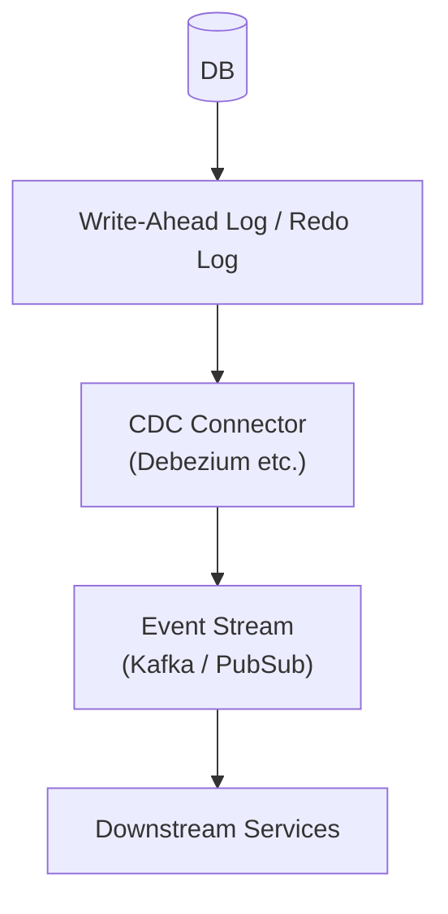

# 🧩 Change Data Capture (CDC)

CDC (Change Data Capture) is a mechanism providing **structure to detect database changes in real-time and deliver them as events to outside.**

## ✅ Overview

Acquires DB changes (INSERT / UPDATE / DELETE) at log level, and reflects them to stream without going through application.

## ✅ Problems Addressed

- App forgot to fire event even though DB was changed.
- Flow involving app became complex and consistency cannot be maintained.
- App cannot withstand high throughput event generation.

By CDC, **DB changes are reliably turned into events without going through app.**

## ✅ Basic Philosophy & Structure

- Read DB logs (WAL / binlog).
- Deliver change difference as event.
- Change to app is unnecessary (DB is sole truth source).

## ✅ Suitable Cases

- Asynchronous replication of massive data.
- Don't want to write event generation in app.
- Immediate reflection to data pipeline / analysis platform.

## ❌ Unsuitable Cases

- DB schema changes frequently and is unstable.
- Want to control all synchronous processing with strong consistency.

## ✅ Related Styles

- [Outbox Pattern](./outbox-pattern.md): Difference of App via vs DB via.
- [Event Sourcing](../data/event-sourcing.md): Philosophy treating event as truth of data.
- [EDA](./event-driven.md): Event-driven in general.

## ✅ Summary

CDC is a mechanism balancing consistency and scale by **DB-driven event generation**.  
It is a central technique of modern data architecture in that it can offload event generation, which tends to become complex in applications, to DB.
