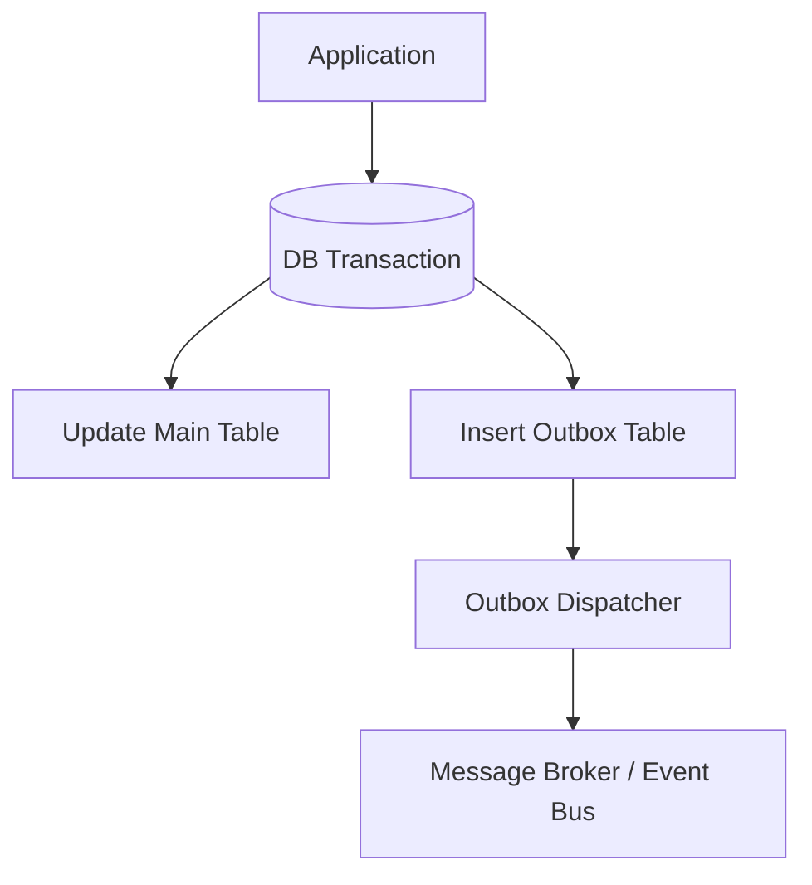

# 🧩 Outbox Pattern (Transactional Outbox)

Outbox Pattern is a representative Integration pattern to resolve **inconsistency between data consistency and event delivery** in inter-service coordination.

## ✅ Overview

Takes a structure where **(A) DB Update and (B) Event Recording** are performed simultaneously within application's local transaction, and then events are delivered to outside from buffer (Outbox table).

## ✅ Problems Addressed

- DB update succeeded but event transmission failed.
- Event was sent but DB update was rolled back.
- Want to avoid distributed transaction (2PC).
- Cannot maintain strong consistency between microservices.

Outbox Pattern prevents discrepancy by **confining everything in local DB transaction**.

## ✅ Basic Philosophy & Structure

- Outbox table is buffer for "unsent events".
- Dispatcher reads Outbox periodically and sends to Kafka / SNS / etc.
- Delete or mark Outbox record as done after success.

## ✅ Suitable Applications

- Data consistency between microservices is important.
- Business systems centered on CRUD + Event coordination.
- Cases wanting to leave audit / change history.

## ❌ Unsuitable Cases

- Generating massive events at ultra-high frequency (Outbox becomes bottleneck).
- Workloads where latency is extremely severe.

## ✅ Related Styles

- Change Data Capture (CDC)
- Event-driven Architecture (EDA)
- Saga Pattern (Especially Orchestration)

## ✅ Summary

Outbox Pattern is the **most practical consistency assurance pattern** in microservices era, and is a standard method to avoid discrepancy between DB update and event delivery.
