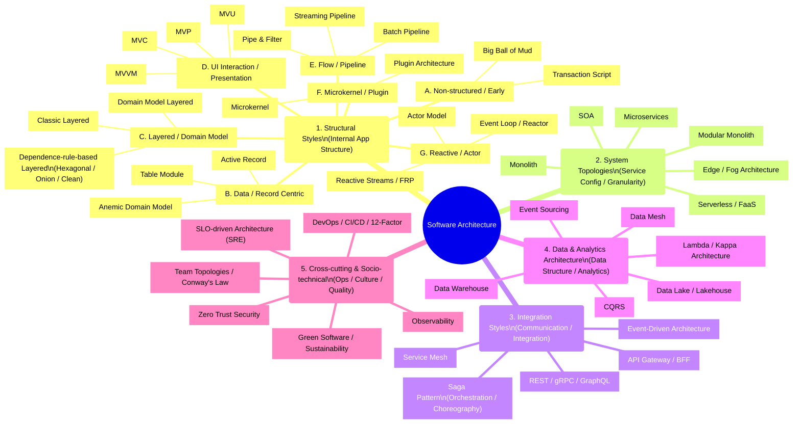
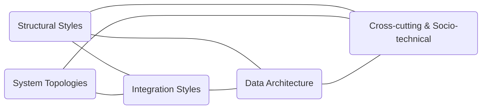

# The Map of Software Architecture

This site aims to provide a "map" for systematically understanding software architecture.
Architecture is not a single concept but a domain where multiple design layers overlap, making it difficult to grasp the big picture. This site organizes them and provides guidelines for understanding their interrelationships.

## ✅ Why Architecture is Confusing

The reason architectural discussions often become confusing is that designs of different dimensions are frequently discussed in the same context.
The following are representative layers, each having independent design axes:

- **[Internal Application Structure](./structural/index.md)** (Layered, MVC, Hexagonal, etc.)
- **[System Topologies & Granularity](./topologies/index.md)** (Monolith, Microservices)
- **[Integration Styles](./integration/index.md)** (REST, gRPC, Event-driven)
- **[Data Structure & Analytics](./data/index.md)** (DWH, Data Lake, Event Sourcing)
- **[Operations & Organization](./cross-cutting/index.md)** (DevOps, SRE, Team Topologies)

These are completely different design layers—"Structure, Deployment, Communication, Data, Operations"—and cannot be integrated into a single diagram or concept.

## ✅ Categorization Structure of This Site

The categorization of this site is designed based on historical trends in recent architectural discussions.

- **[Dependency Rule-based styles](./structural/layered/dependency-rule-layered/index.md)** ([Hexagonal](./structural/layered/dependency-rule-layered/hexagonal.md) / [Onion](./structural/layered/dependency-rule-layered/onion.md) / [Clean Architecture](./structural/layered/dependency-rule-layered/clean.md)) have become strongly established in practice.
- These deepened as the **main topic of internal application structure** from the 2000s to the 2010s.
- In contrast, recent evolution has centered on **"outer layers"** such as **[Topologies](./topologies/index.md) ([Monolith](./topologies/monolith.md) to [Microservices](./topologies/microservices.md)), [Integration](./integration/index.md), [Data](./data/index.md), and [Socio-technical aspects](./cross-cutting/index.md)**.

Based on this background, this site adopts a structure that:
**Finely categorizes [Structural Styles (Internal Application Structure)](./structural/index.md) and organizes the outer layers as separate categories.**

### [1. Structural Styles (Internal Application Structure)](./structural/index.md)

In recent discussions, styles centered on the **[Dependency Rule](./structural/layered/dependency-rule-layered/index.md)** ([Hexagonal](./structural/layered/dependency-rule-layered/hexagonal.md) / [Onion](./structural/layered/dependency-rule-layered/onion.md) / [Clean](./structural/layered/dependency-rule-layered/clean.md)) have become strongly established and treated as the central topic of internal application structure.
Therefore, Structural Styles are categorized more finely than other categories.

Note that implementation techniques like Vertical Slice / Feature-based are positioned as supplementary specific configuration patterns of existing styles.

### [2. System Topologies (System Configuration & Granularity)](./topologies/index.md)

This area deals with deployment strategies, ranging from [Monolith](./topologies/monolith.md) to [Microservices](./topologies/microservices.md), [Serverless](./topologies/serverless.md), and [Edge](./topologies/edge.md). It is the category with the most significant evolution in recent years.

### [3. Integration Styles (Communication & Coordination)](./integration/index.md)

Deals with service-to-service communication methods and integration patterns, such as [REST, gRPC](./integration/rest-grpc-graphql.md), [Event-driven](./integration/event-driven.md), and [Service Mesh](./integration/service-mesh.md).

### [4. Data & Analytics Architecture (Data Structure & Analytics Platform)](./data/index.md)

Organizes the evolution of data design, from traditional [DWH](./data/data-warehouse.md) and [Data Lakes](./data/data-lake-lakehouse.md) to operation separation with [CQRS](./data/cqrs.md)/[Event Sourcing](./data/event-sourcing.md) and distributed responsibilities with [Data Mesh](./data/data-mesh.md).

### [5. Cross-cutting & Socio-technical (Operations, Culture, Quality)](./cross-cutting/index.md)

Deals with areas involving not just technical foundations but also organization, operations, and culture, such as [DevOps](./cross-cutting/devops.md), [SRE](./cross-cutting/slo-sre.md), [Observability](./cross-cutting/observability.md), [Zero Trust](./cross-cutting/zero-trust.md), and [Team Topologies](./cross-cutting/team-topologies.md).

## 🧩 Overall Software Architecture Mindmap

## 🧩 Relationship Diagram Between Categories (Cross-cutting Edges)

## 🧩 Guide to Understanding the Overall Architecture

Before reading individual categories like internal structure, system configuration, communication methods, and data platforms, supplementary pages are provided to give an overview of the big picture.

### ● [Architecture Principles](./arch-principles.md)

Organizes fundamental concepts common to architecture (Dependency Direction, Boundaries, Coupling & Cohesion, Consistency Models, Sync/Async, etc.).

### ● [Architecture Decision Guide](./decision-guide.md)

A systematic guide on how to select outer structures (Topologies / Integration / Data / Cross-cutting) based on requirements, constraints, and organizational structure.

### ● [Structural Styles Decision Guide](./structure-decision-guide.md)

A guide on how to select internal application structures (Layered / Clean / Hexagonal / MVC / MVVM / Transaction Script, etc.) based on domain complexity, changeability, and team structure.

Reading these as prerequisites for each category helps in appropriately positioning individual styles while overlooking the entire architecture.

## 🧭 Pages to Read Next

- [**Structural Styles (Internal App Structure)**](./structural/index.md)
- [**System Topologies (Service Config & Granularity)**](./topologies/index.md)
- [**Integration Styles (Communication & Integration)**](./integration/index.md)
- [**Data Architecture (Data Structure & Analytics)**](./data/index.md)
- [**Cross-cutting & Socio-technical (Ops, Culture, Quality)**](./cross-cutting/index.md)

Each category is explained from the following perspectives:

- Problems it attempts to solve
- Philosophy and structure of the style
- Suitable application areas
