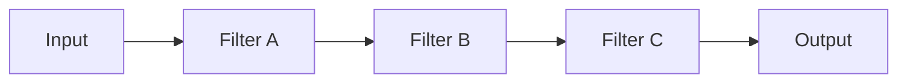

# 🧩 Pipe & Filter

## ✅ Overview

**A structural style where input data is transformed while passing through a series of filters (processing stages).**
Image of applying the idea of Unix `cmd1 | cmd2 | cmd3` inside a program.

## ✅ Problems Addressed

- All logic is packed into one huge processing function.
- Difficult to replace, reuse, or test specific steps.
- Input/Output are intricately intertwined, making the processing flow hard to read.

Pipe & Filter aims to make the processing flow:

- Clear to see
- Easy to replace
- Easy to parallelize

By:

> "Splitting processing into small filters and connecting data with pipes."

## ✅ Basic Philosophy & Rules

### ● Filter

- Processing stage with single responsibility.
- Receives input stream and returns output stream.
- Side effects are minimal (ideally close to pure functions).

### ● Pipe

- Data flow connecting filters.
- Implementation varies: in-memory function calls, queues, messaging, etc.

### ● Example Flow

```text
Input → FilterA → FilterB → FilterC → Output
```

- Branching and merging can also be done in between.

### Conceptual Diagram



## ✅ Suitable Applications

- Text processing / Log processing.
- Sequential conversion of Image / Audio / Video.
- Part of ETL processing (Extract → Transform → Load).
- Batch processing combining small tools.

Especially powerful when you can explain:

> "This processing flow passes through A → B → C in this order."

## ❌ Unsuitable Cases

- Logic strongly involving stateful processing (Workflow centered on state transitions).
- UI requiring bidirectional communication or complex interaction.
- Simple CRUD apps (cost of connecting pipes is higher).

## ✅ History (Genealogy / Parent Styles)

- Roots in Unix pipe mechanism.
- Introduced as "Pipe & Filter" in early software architecture literature.
- Influenced subsequent styles like Data Pipeline / Streaming Pipeline.

## ✅ Related Styles

- **Batch Pipeline**: Pipeline structure as batch processing.
- **Streaming Pipeline**: Evolution to real-time processing.
- **Reactive / Actor**: Often combined with event stream processing.

## ✅ Representative Frameworks

Pipe & Filter naturally appears in many environments as a lightweight processing pipeline.

- **Unix / Linux CLI (`cmd1 | cmd2 | cmd3`)**
  Pipe structure itself. Can be called the prototype.

- **Node.js Streams**
  Structure of `Readable → Transform → Writable` is exactly Pipe & Filter.

- **Golang (io.Reader / io.Writer)**
  Easy to connect unidirectional streams through interfaces.

- **Image / Video Processing Tools (FFmpeg etc.)**
  Can build complex processing by connecting small conversion processes with pipes.

## ✅ Design Patterns Supporting This Style

The internal structure of Pipe & Filter is established by a combination of multiple design patterns.

- **Chain of Responsibility**
  Applies filters sequentially as a "processing chain".

- **Iterator**
  Used when processing stream data sequentially.

- **Strategy**
  Expresses algorithms of each filter in a replaceable form.

- **Mediator**
  Appears when coordination between stages is necessary (Branching / Merging etc.).

## ✅ Summary

Pipe & Filter is a style handling complexity with the simple idea of:

- Splitting processing into small stages.
- Connecting stages with clear data flow.

It is worth considering as the **first candidate** when wondering "How to split huge processing?".
