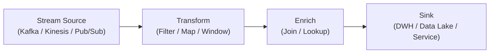

# 🧩 Streaming Pipeline

## ✅ Overview

**A style that continues to process continuously flowing data/events with a pipeline without interruption.**

- Pipeline assuming data is always "flowing".
- Strong in almost real-time aggregation, detection, and transformation.
- Targets **Stream (Flow)** as design object, not Batch.

## ✅ Problems Addressed

Streaming Pipeline appears when you want to solve challenges that cannot be handled by batch processing or one-off ETL, such as:

- Number of events is large, and **each batch processing becomes too heavy**.
- "Hourly batch" is slow, want to **detect/react almost in real-time**.
- Multiple teams or systems want to **continuously use** the same data.
- Logs / Sensors / Transaction data **keep increasing constantly**.

It answers the need:

> "Want to design not only the result but the process of data flowing as a continuously moving pipeline."

## ✅ Basic Structure & Concept

In Streaming Pipeline, data flows in steps like:

1. **Source**
   - Receive events from Kafka Topic / Kinesis Stream / Pub/Sub etc.
2. **Transform**
   - Perform filtering, mapping, joining, window aggregation, etc.
3. **Enrich**
   - Add information using other streams or reference data.
4. **Sink**
   - Output to storage ([DWH](../../data/data-warehouse.md) / [Data Lake](../../data/data-lake-lakehouse.md)), downstream systems, dashboards, etc.

Characteristic elements:

- **Immutable Event / Append-only**: Do not overwrite past events, treat as "facts that flowed".
- **Windowing**: Aggregation / detection per certain time (e.g., number of errors in last 5 mins).
- **Stateful Processing**: Hold state in the middle of stream processing and update continuously.
- **Backpressure / Rate Control**: Control not to exceed processing capacity against large input.

### Conceptual Diagram

## ✅ Suitable Applications

Streaming Pipeline is particularly powerful in areas like:

- **Log / Metrics Processing**  
  Real-time aggregation and alerting of access logs, application logs, metrics.

- **Event-driven Services**  
  Recommendation, personalization, feed generation based on user behavior events.

- **IoT / Sensor Systems**  
  Continuous monitoring and anomaly detection of telemetry from sensors and devices.

- **Payment / Transaction Monitoring**  
  Fraud detection, real-time risk assessment, etc.

## ❌ Unsuitable Cases

Streaming Pipeline does not mean "Everything should be done with streaming".

- **One-off Aggregation or Migration**  
  One-off heavy processing is often simpler with Batch.

- **Processing requiring strict batch consistency**  
  Cases where it is safer to judge at once after all data is gathered (e.g., end-of-term batch settlement).

- **Simple CRUD-centric Business Systems**  
  Often there is no need to design as a stream in the first place.

## ✅ History (Genealogy / Parent Styles)

Streaming Pipeline evolved from the following contexts:

- Extended ideas of **[Pipe & Filter](./pipe-and-filter.md)** and **[Batch Pipeline](./batch-pipeline.md)** to real-time processing.
- Evolved from **Log Aggregation Platform** (Hadoop era) to Distributed Log Platform like Kafka + Stream Processing Engine.
- Formulated as "Speed Layer" / "Stream Layer" in Lambda / Kappa Architecture.

It is a pipeline style swinging in the direction of:

> "Exceeding limits of batch, continuing to process every time data arrives."

## ✅ Relationship with Related Styles

- **[Pipe & Filter](./pipe-and-filter.md)**  
  Model is the same connection of stages, but Streaming assumes "always flowing".

- **[Batch Pipeline](./batch-pipeline.md)**  
  Difference is whether processing unit is "per Job / Daily / Hourly" or "per Event / Time Window".

- **[Event-driven Architecture / EDA](../../integration/event-driven.md)**  
  When event flow crosses system boundaries, Streaming Pipeline appears as its internal processing.

- **[Lambda / Kappa Architecture (Data)](../../data/lambda-kappa.md)**  
  Often appears in the context of how to combine stream processing and [DWH](../../data/data-warehouse.md) / [Data Lake](../../data/data-lake-lakehouse.md).

## ✅ Representative Frameworks

Representative platforms/frameworks realizing Streaming Pipeline include:

- **Apache Kafka Streams / ksqlDB**  
  Stream processing dedicated library on Kafka. Can describe stream transformation, join, and aggregation between topics.

- **Apache Flink**  
  Distributed processing engine strong in stream processing. Capable of complex window processing and state management.

- **Apache Beam (Streaming Mode)**  
  Can describe Batch / Streaming with the same model, portable to multiple runtimes like Dataflow.

- **Amazon Kinesis / Google Cloud Pub/Sub + Dataflow etc.**  
  Can build streaming pipelines as managed services.

## ✅ Design Patterns Supporting This Style

Streaming Pipeline is a combination of the following object-oriented design patterns:

- **Iterator**  
  Treats stream as an abstraction to "take out next element in order".

- **Observer**  
  Subscribes to arrival of new events and triggers processing.

- **Chain of Responsibility**  
  Connects multiple processing stages and processes events stepwise.

- **Mediator**  
  Aggregates routing and joining in one place when multiple streams or stages are involved.

- **Strategy**  
  Makes processing logic (aggregation algorithm or filter condition) per stage replaceable.

## ✅ Summary

Streaming Pipeline is a pipeline style for:

- Assuming data continues to flow constantly
- Combining stages
- Processing / Aggregating / Detecting almost in real-time

While being in the same genealogy as [Pipe & Filter](./pipe-and-filter.md) / [Batch Pipeline](./batch-pipeline.md),
its biggest feature is making:

> **"Processing flow that continues to move every time data comes"**

The protagonist of design.

In systems with high requirements for data volume, real-time performance, and scalability,  
design conscious of Streaming Pipeline becomes an important architectural option.
