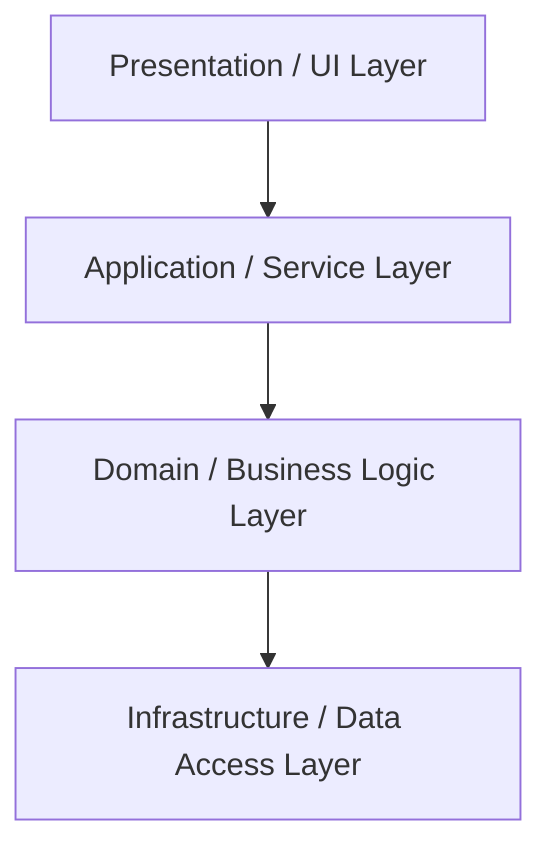

# 🧩 Classic Layered Architecture

## ✅ Overview

**A structural style where the application is divided into layers like UI / Application / Domain / Infrastructure, and upper layers depend on lower layers.**
Also known as the most widely known "3-tier / n-tier architecture".

## ✅ Problems Addressed

- Spaghetti structure where screen (UI), business logic, and DB access are mixed.
- Unpredictable scope of impact when making changes.
- Difficulty in dividing work among teams.

Classic Layered aims to **make the structure clear** by:

> "Grouping code with similar responsibilities into layers and organizing vertical dependencies."

## ✅ Basic Philosophy & Rules

Typical layer structure:

- Presentation / UI
- Application / Service
- Domain / Business Logic
- Infrastructure / Data Access

Basic Rules:

- Upper layers can depend on lower layers.
- Lower layers should avoid depending on upper layers.
- Avoid "jumping" layers (e.g., connecting UI directly to DB).

In implementation, it is often operated with a structure where:

- Layers are separated by packages or namespaces.
- Dependencies within a layer are relatively free.

## ✅ Conceptual Diagram

## ✅ Suitable Applications

- General business Web applications.
- Internal systems where business logic is not overly complex.
- Apps centered on straightforward CRUD for each screen or API.
- Development assuming team division (Frontend / Backend / DB).

Classic Layered is effective as a **standard solution for "splitting for now"**.

## ❌ Unsuitable Cases

- When domain rules are complex and you want to design a domain model in earnest.
- Applications assuming external service integration or multiple UIs.
- When you want to minimize dependency on frameworks or DBs.

Typical limitations:

- The Domain layer tends to become thin (logic concentrates in Application/Service).
- Infrastructure dependencies (ORM, frameworks) easily erode into the Domain.
- Tests get dragged down by infrastructure dependencies.

## ✅ History (Genealogy / Parent Styles)

- Emerged as an evolution from the Non-structured ~ Transaction Script era.
- Became the standard style for enterprise apps in the 90s-2000s.
- Organized in Fowler's _Patterns of Enterprise Application Architecture_, etc.
- A "base camp" style that later evolved into DDD and Hexagonal.

## ✅ Related Styles

- **Domain Model Layered**: An evolved form with a thicker domain layer.
- **Hexagonal / Onion / Clean**: Further evolved forms that strictly manage dependency direction.
- **MVC / MVVM**: Used in combination as the structure within the UI layer.

## ✅ Representative Frameworks

Classic Layered is one of the most common structural styles, and many frameworks assume this shape or naturally induce it.

- **Spring Boot (Java)**
  A 3-tier structure of Controller / Service / Repository is presented as a standard sample.

- **ASP.NET Core / .NET**
  Templates with layered configurations like Presentation / Application / Domain / Infrastructure are abundant.

- **NestJS (Node.js)**
  Configurations like Module / Controller / Provider make it easy to design leaning towards layered.

- **Angular**
  Although a UI framework, it is easy to think in a 3-tier structure of Component / Service / Data Access.

## ✅ Design Patterns Supporting This Style

Classic Layered itself is a simple division of responsibilities, but the following patterns are often used to organize relationships between layers.

- **Facade**
  Hides the complexity of lower layers from upper layers (UI / Application) and provides a unified interface.

- **Strategy**
  Used when switching variations of business logic in the Application / Domain layer.

- **Template Method**
  Commonizes the skeleton when multiple Services or Repositories have similar processing procedures.

- **Proxy**
  Used when wrapping access to external APIs, caches, or remote services in the Infrastructure layer.

## ✅ Summary

Classic Layered is still an active style in the sense that:

- It is simple and easy to understand.
- Many frameworks and sample codes assume it.

On the other hand, because of limitations like:

- Framework dependency and weak domain expression

It is good to position it as a **reference point for considering the next developmental stage (Domain Model / Hexagonal, etc.) in more complex systems.**
