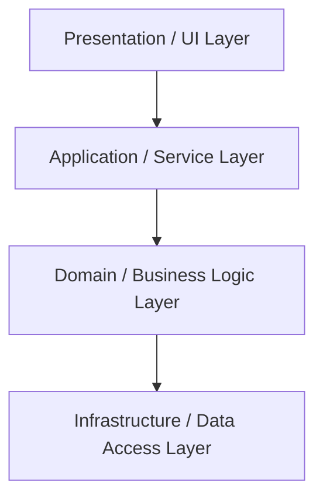

# Classic Layered Architecture（クラシックレイヤードアーキテクチャ）

## 1. 一言でいうと

**UI / Application / Domain / Infrastructure のようにアプリケーションを層に分割し、上位レイヤーが下位レイヤーに依存する構造スタイル。**
最も広く知られている「3 層 / n 層アーキテクチャ」。

---

## 2. 解決しようとした問題

- 画面（UI）・ビジネスロジック・DB アクセスが混在したスパゲッティ構造
- 変更の影響範囲が読めない
- チーム分業がしづらい

Classic Layered は、

> 「似た責務のコードを層としてまとめ、上下の依存を整理する」

ことで、**構造を見通し良くする** ことを狙います。

---

## 3. 基本思想・ルール

典型的なレイヤー構造：

- Presentation / UI
- Application / Service
- Domain / Business Logic
- Infrastructure / Data Access

基本ルール：

- 上位レイヤーは下位レイヤーに依存してよい
- 下位レイヤーが上位レイヤーに依存することは避ける
- レイヤーを“ジャンプ”する依存は避ける（UI → DB 直結など）

実装上は、

- パッケージや名前空間でレイヤーを分ける
- レイヤー内の依存は比較的自由

という緩やかなルールで運用されることが多いです。

---

## 3.1 概念図（Conceptual Diagram）

---

## 4. 得意なアプリケーション

- 業務 Web アプリケーション全般
- ビジネスロジックがそこまで複雑ではない社内システム
- 画面や API ごとに素直な CRUD が中心のアプリ
- チーム分業（フロント / バックエンド / DB）を前提とした開発

Classic Layered は **“とりあえずこれで分割する” という標準解** として有効です。

---

## 5. 不向きなケース

- ドメインルールが複雑で、ドメインモデルを本格的に設計したい場合
- 外部サービス連携や複数 UI を前提にしたアプリケーション
- フレームワークや DB への依存を極力減らしたい場合

典型的な限界として：

- Domain 層が薄くなりがち（実質的には Application/Service にロジック集中）
- インフラ依存（ORM・フレームワーク）が Domain に侵食しやすい
- テストがインフラ依存に引きずられる

---

## 6. 歴史（系譜・親スタイル）

- 非構造〜Transaction Script の時代からの進化として登場
- 90〜2000 年代のエンタープライズアプリで標準的なスタイルに
- Fowler の _Patterns of Enterprise Application Architecture_ などで整理
- のちに DDD や Hexagonal へと発展する “ベースキャンプ”的な存在

---

## 7. 関連スタイル

- **Domain Model Layered**：ドメイン層を厚くした発展系
- **Hexagonal / Onion / Clean**：依存方向を厳しく管理するさらなる発展系
- **MVC / MVVM**：UI 層内部の構造として組み合わせて利用される

---

## 8. Framework Examples（代表的なフレームワーク）

Classic Layered はもっとも一般的な構造スタイルのひとつであり、多くのフレームワークがこの形を前提にしているか、自然に誘導します。

- **Spring Boot（Java）**  
  Controller / Service / Repository といった 3 層構造が標準的なサンプルとして提示される。

- **ASP.NET Core / .NET**  
  Presentation / Application / Domain / Infrastructure のようなレイヤード構成のテンプレートが豊富。

- **NestJS（Node.js）**  
  Module / Controller / Provider といった構成が、レイヤードに寄せた設計をしやすくしている。

- **Angular**  
  UI フレームワークだが、Component / Service / Data Access という 3 層的な構造で考えやすい。

---

## 9. Supported Design Patterns（このスタイルを支えるデザインパターン）

Classic Layered 自体はシンプルな責務分割だが、レイヤー間の関係を整理するために次のパターンがよく使われる。

- **Facade**  
  上位レイヤ（UI / Application）から下位レイヤの複雑さを隠し、統一インターフェースを提供する。

- **Strategy**  
  ビジネスロジックのバリエーションを Application / Domain レイヤで切り替える際に使われる。

- **Template Method**  
  複数の Service や Repository が似た処理手順を持つ場合、その骨格を共通化する。

- **Proxy**  
  外部 API やキャッシュ、リモートサービスへのアクセスを、Infrastructure レイヤでラップする際に利用される。

---

## 8. まとめ

Classic Layered は、

- シンプルで理解しやすく、
- 多くのフレームワークやサンプルコードが前提としている

という意味で、今でも現役のスタイルです。

一方で、

- フレームワーク依存やドメイン表現の弱さ

といった限界もあるため、**より複雑なシステムでは次の発展段階（Domain Model / Hexagonal など）を検討するための基準点** として位置づけると良いでしょう。
