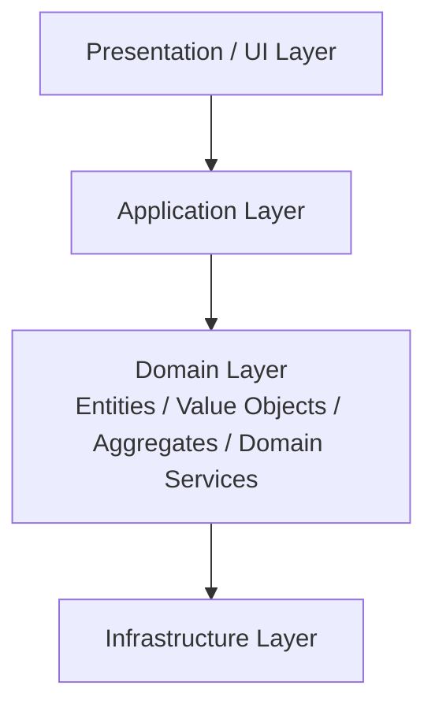

# 🧩 Domain Model Layered

## ✅ Overview

Based on Classic Layered, this style **centers on a rich Domain Model (Aggregates, Entities, Value Objects) in the Domain layer.**
It is a layered architecture compatible with DDD concepts.

## ✅ Problems Addressed

In Classic Layered, the following problems tend to occur:

- The Domain layer becomes a "DTO storage" or common function storage, effectively becoming hollow.
- Business rules are scattered in the Application / Service layer.
- It is difficult to read domain complexity from the code.

Domain Model Layered responds to this with the idea:

> "Express domain concepts as classes and methods in code, and aggregate business rules in the Domain layer."

## ✅ Basic Philosophy & Rules

The layer structure itself is close to Classic Layered, but **the treatment of the Domain layer is decisively different.**

- In the Domain layer:
  - Entities
  - Value Objects
  - Domain Services
  - Aggregates
    Place domain objects such as these.
- Application-specific use case flows go to the Application layer.
- Infrastructure dependencies (DB, External API) go to the Infrastructure layer.

As for dependencies:

- Application → Domain
- Infrastructure → Domain

Ideally, it should look like this (although complete separation is difficult in practice, this is the direction).

In actual implementation, ORM (JPA / Hibernate, etc.) annotations are often directly attached to the domain model, and as a result, Domain → Infrastructure dependencies may remain. This point distinguishes it from "Dependency Rule enhanced" styles like Hexagonal / Clean Architecture that try to separate dependency direction more strictly.

### Conceptual Diagram

## ✅ Suitable Applications

- B2B SaaS / Enterprise systems with complex business rules.
- Areas where state transitions, invariants, and calculation logic are important (Finance, Inventory, Billing, etc.).
- Projects developed while conversing with domain experts in "Domain Language".

Domain Model Layered is particularly effective when **domain complexity is the core value of the business.**

## ❌ Unsuitable Cases

- Apps centered on CRUD where domain rules are simple.
- Systems where "DB Schema ≒ Screen Items" structure is sufficient.
- When the team's proficiency in Object-Oriented / DDD is low, and it rather becomes complex.

Forcing the introduction of a domain model can lead to a state where "only the concepts are complex, but the implementation cannot keep up."

## ✅ History (Genealogy / Parent Styles)

- Emerged as an evolved form of Classic Layered.
- A style heavily influenced by Fowler's PoEAA and Evans' DDD.
- Later connects to "Dependency Rule enhanced" styles like Hexagonal / Onion / Clean.

## ✅ Related Styles

- **Classic Layered**: Prototype style treating the domain thinly.
- **Hexagonal / Onion / Clean**: Evolved forms trying to protect the domain even more strongly.
- **DDD (Tactical Patterns)**: Concrete model expressions like Entities, Value Objects, Aggregates.

## ✅ Representative Frameworks

Domain Model Layered is a framework-independent style, but is often adopted in environments like:

- **Spring Boot (Java)**
  Samples and books on DDD + Layered configuration are very abundant, making it easy to refer to as a typical example of Domain Model Layered.

- **ASP.NET Core / .NET**
  Layered configurations combined with DDD (Application / Domain / Infrastructure) are adopted in many templates.

- **NestJS**
  Due to the good compatibility of Module / Provider structure with TypeScript, it is easy to align with a domain model-centric layered configuration.

## ✅ Design Patterns Supporting This Style

To support the structure centered on the domain model (Aggregates, Entities, Value Objects), the following patterns often appear.

- **Strategy**
  Expresses the behavior of domain objects (billing calculation, discounts, conditional branching, etc.) in a replaceable way.

- **Composite**
  Handles domains with hierarchical structures (tree-like categories, organizations, components, etc.) with a consistent interface.

- **Mediator**
  Aggregates and mediates complex interactions between multiple entities in one place.

- **Template Method**
  Used for commonization when domain services or aggregate roots have similar processing flows.

## ✅ Summary

Domain Model Layered is a style that attempts to balance:

- The ease of understanding of Layered Architecture
- The strength of the domain model in DDD

When domain complexity begins to increase, **it is worth considering adoption as the "next step" from Classic Layered.**
