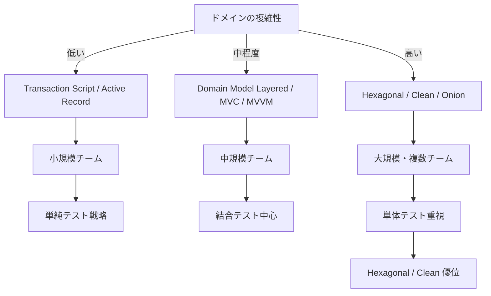

# 🧩 Structural Styles Decision Guide（アプリ内部構造の選定ガイド）

アプリケーション内部構造（Structural Styles）は、外側のトポロジーや通信方式とは異なり、**コードベースの変更容易性・保守性・テスト性に直接影響する領域** である。  
本ガイドでは、主要な構造スタイルをどのように選ぶべきかを、実務で役立つ判断基準に基づいて整理する。

## ✅ 判断軸 1：ドメインの複雑性（Domain Complexity）

最初に見るべきは、対象ドメインがどれほど複雑かである。

### ● 低い（CRUD 中心）

- Transaction Script
- Active Record
- Table Module

**向いている理由：**  
ロジックが薄く、複雑なモデル表現が不要であるため。

### ● 中程度（業務ルールが一定程度存在）

- Domain Model Layered
- MVC / MVVM など UI 主導構造
- 複数のサービスと連携するがドメインはそこまで難しくないケース

### ● 高い（複雑なルール・状態遷移・不変条件）

- Hexagonal
- Clean Architecture
- Onion Architecture

**向いている理由：**  
依存方向ルールによりドメインモデルが外部から独立し、変更に強くなる。

## ✅ 判断軸 2：変更容易性（Changeability）

どこが頻繁に変わるのか？  
どの層が多様な UI / API / 永続化方式に晒されるのか？

### ● プレゼンテーション層が頻繁に変わる

- Hexagonal（Port/Adapter により UI を差し替えやすい）

### ● 永続化が変わる可能性が高い

- Hexagonal / Clean（Domain → Infrastructure の依存を逆転させる）

### ● とにかく素早く書きたい

- Transaction Script / Active Record

## ✅ 判断軸 3：チーム規模と構造化要求

### ● 小規模（1〜3 人）

- Active Record
- Transaction Script
- MVVM / MVC

### ● 中規模（4〜10 人）

- Domain Model Layered
- MVC → MVVM への移行なども選択肢

### ● 大規模・複数チーム

- Hexagonal
- Clean Architecture
- Onion Architecture
- Modular Monolith（構造と境界を明確にする）

## ✅ 判断軸 4：テスト戦略（Testing Strategy）

### ● 単体テストを最重要視する

- Hexagonal / Clean（Port/Adapter による isolation が効く）

### ● 結合テスト中心

- Classic Layered

### ● 手動テストに依存（レガシー / 短期開発）

- Active Record でも実務上成立する

## ✅ 判断軸 5：UI 主導か Domain 主導か

### ● UI 主導（表示が中心・複雑 UI）

- MVC
- MVP
- MVVM
- MVU

### ● Domain 主導（業務ロジックが中心）

- Domain Model Layered
- Hexagonal / Clean

## 🧭 最終選定チャート（Mermaid）

## ✅ まとめ

Structural Styles は「どれが優れているか」ではなく、  
**どのような構造が、プロダクトの性質・複雑性・チーム体制・変更要求に適しているか**  
によって選択される。

- ドメインが複雑なら Dependency Rule 系（Hexagonal / Clean）
- 小規模・短期なら Transaction Script / Active Record
- UI 主導なら MVC / MVVM
- チームが大きくなるほど、境界の明確化が重要になる

アプリ内部構造は、外側の Topologies や Integration、Data と連動しつつも、  
**コードの保守性を支える最も具体的なアーキテクチャレイヤ** である。
