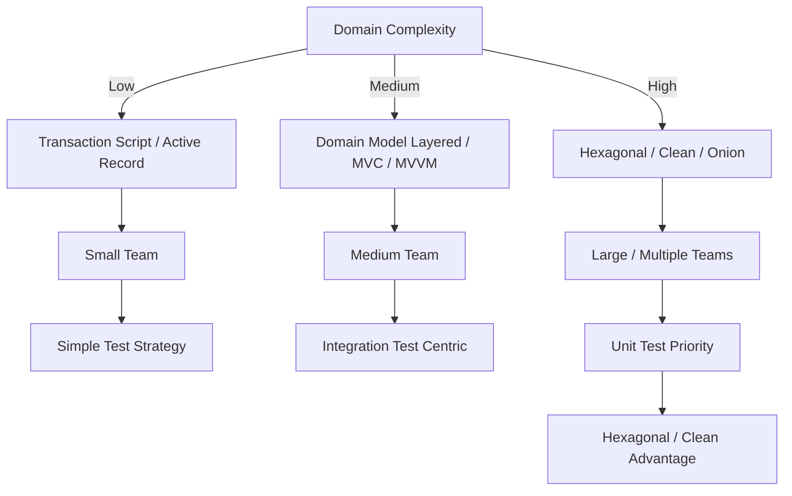

# 🧩 Structural Styles Decision Guide

Internal Application Structure (Structural Styles) differs from outer topologies and communication methods; it is an **area that directly affects the changeability, maintainability, and testability of the codebase.**
This guide organizes how to select major structural styles based on practical judgment criteria.

Note that UI patterns like MVC / MVP / MVVM / MVU deal strictly with the structure of the presentation layer and exist on a different axis from system-wide internal structural styles like Hexagonal or Layered. Therefore, it is common to combine an internal structural style with a UI pattern, such as "Hexagonal + MVVM".
The distinction between "UI-driven" and "Domain-driven" here refers to "which layer is the starting point of design." The UI pattern itself is a structure limited to the presentation layer and can coexist with styles like Hexagonal / Layered on the backend.

## ✅ Axis 1: Domain Complexity

The first thing to look at is how complex the target domain is.

### ● Low (CRUD centric)

- Transaction Script
- Active Record
- Table Module

**Reason for suitability:**
Logic is thin, and complex model expression is unnecessary.

### ● Medium (Business rules exist to some extent)

- Domain Model Layered
- UI-driven structures like MVC / MVVM
- Cases involving coordination with multiple services but the domain itself is not overly difficult

### ● High (Complex rules, state transitions, invariants)

- Hexagonal
- Clean Architecture
- Onion Architecture

**Reason for suitability:**
The Dependency Rule makes the domain model independent of the outside, making it robust against changes.

## ✅ Axis 2: Changeability

What changes frequently?
Which layer is exposed to diverse UI / API / persistence methods?

### ● Presentation layer changes frequently

- Hexagonal (UI can be easily swapped via Port/Adapter)

### ● Persistence is likely to change

- Hexagonal / Clean (Invert the dependency of Domain → Infrastructure)

### ● Want to write quickly anyway

- Transaction Script / Active Record

## ✅ Axis 3: Team Scale and Structuring Requirements

### ● Small Scale (1-3 people)

- Active Record
- Transaction Script
- MVVM / MVC

### ● Medium Scale (4-10 people)

- Domain Model Layered
- Migration from MVC → MVVM is also an option

### ● Large Scale / Multiple Teams

- Hexagonal
- Clean Architecture
- Onion Architecture
- Modular Monolith (Clarify structure and boundaries)

## ✅ Axis 4: Testing Strategy

### ● Prioritize Unit Testing

- Hexagonal / Clean (Isolation via Port/Adapter is effective)

### ● Integration Test Centric

- Classic Layered

### ● Rely on Manual Testing (Legacy / Short-term dev)

- Active Record is viable in practice

## ✅ Axis 5: UI-driven vs Domain-driven

### ● UI-driven (Display centric / Complex UI)

- MVC
- MVP
- MVVM
- MVU

### ● Domain-driven (Business logic centric)

- Domain Model Layered
- Hexagonal / Clean

## 🧭 Final Selection Chart (Mermaid)

## ✅ Summary

Structural Styles are selected not by "which is superior," but by **what structure is suitable for the product's nature, complexity, team structure, and change requirements.**

- If the domain is complex, use Dependency Rule styles (Hexagonal / Clean).
- If small-scale/short-term, use Transaction Script / Active Record.
- If UI-driven, use MVC / MVVM.
- As the team grows, clarifying boundaries becomes more important.

Internal application structure works in conjunction with outer Topologies, Integration, and Data, but it is the **most concrete architectural layer that supports code maintainability.**
