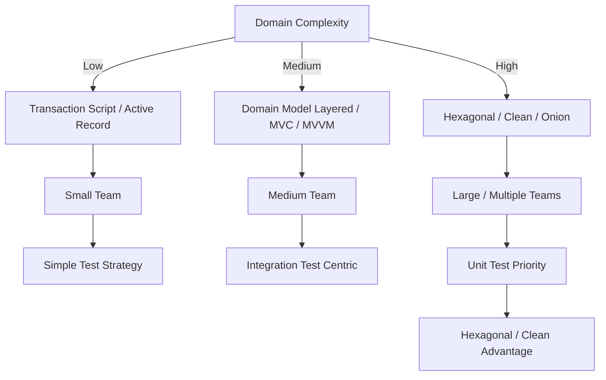

# 🌟 Structural Styles Decision Guide

[Internal Application Structure (Structural Styles)](./structural/index.md) differs from outer topologies and communication methods; it is an **area that directly affects the changeability, maintainability, and testability of the codebase.**
This guide organizes how to select major structural styles based on practical judgment criteria.

Note that UI patterns like [MVC](./structural/ui/mvc.md) / [MVP](./structural/ui/mvp.md) / [MVVM](./structural/ui/mvvm.md) / [MVU](./structural/ui/mvu.md) deal strictly with the structure of the presentation layer and exist on a different axis from system-wide internal structural styles like [Hexagonal](./structural/layered/dependency-rule-layered/hexagonal.md) or [Layered](./structural/layered/index.md). Therefore, it is common to combine an internal structural style with a UI pattern, such as "[Hexagonal](./structural/layered/dependency-rule-layered/hexagonal.md) + [MVVM](./structural/ui/mvvm.md)".

The distinction between "UI-driven" and "Domain-driven" here refers to "which layer is the starting point of design." The UI pattern itself is a structure limited to the presentation layer and can coexist with styles like [Hexagonal](./structural/layered/dependency-rule-layered/hexagonal.md) / [Layered](./structural/layered/index.md) on the backend.

## ✅ Axis 1: Domain Complexity

The first thing to look at is how complex the target domain is.

### ● Low (CRUD centric)

- [Transaction Script](./structural/early/transaction-script.md)
- [Active Record](./structural/data-centric/active-record.md)
- [Table Module](./structural/data-centric/table-module.md)

**Reason for suitability:**
Logic is thin, and complex model expression is unnecessary.

### ● Medium (Business rules exist to some extent)

- [Domain Model Layered](./structural/layered/domain-model-layered.md)
- UI-driven structures like [MVC](./structural/ui/mvc.md) / [MVVM](./structural/ui/mvvm.md)
- Cases involving coordination with multiple services but the domain itself is not overly difficult

### ● High (Complex rules, state transitions, invariants)

- [Hexagonal](./structural/layered/dependency-rule-layered/hexagonal.md)
- [Clean Architecture](./structural/layered/dependency-rule-layered/clean.md)
- [Onion Architecture](./structural/layered/dependency-rule-layered/onion.md)

**Reason for suitability:**
The Dependency Rule makes the domain model independent of the outside, making it robust against changes.

## ✅ Axis 2: Changeability

What changes frequently?
Which layer is exposed to diverse UI / API / persistence methods?

### ● Presentation layer changes frequently

- [Hexagonal](./structural/layered/dependency-rule-layered/hexagonal.md) (UI can be easily swapped via Port/Adapter)

### ● Persistence is likely to change

- [Hexagonal](./structural/layered/dependency-rule-layered/hexagonal.md) / [Clean](./structural/layered/dependency-rule-layered/clean.md) (Invert the dependency of Domain → Infrastructure)

### ● Want to write quickly anyway

- [Transaction Script](./structural/early/transaction-script.md) / [Active Record](./structural/data-centric/active-record.md)

## ✅ Axis 3: Team Scale and Structuring Requirements

### ● Small Scale (1-3 people)

- [Active Record](./structural/data-centric/active-record.md)
- [Transaction Script](./structural/early/transaction-script.md)
- [MVVM](./structural/ui/mvvm.md) / [MVC](./structural/ui/mvc.md)

### ● Medium Scale (4-10 people)

- [Domain Model Layered](./structural/layered/domain-model-layered.md)
- Migration from [MVC](./structural/ui/mvc.md) → [MVVM](./structural/ui/mvvm.md) is also an option

### ● Large Scale / Multiple Teams

- [Hexagonal](./structural/layered/dependency-rule-layered/hexagonal.md)
- [Clean Architecture](./structural/layered/dependency-rule-layered/clean.md)
- [Onion Architecture](./structural/layered/dependency-rule-layered/onion.md)
- [Modular Monolith](./topologies/modular-monolith.md) (Clarify structure and boundaries)

## ✅ Axis 4: Testing Strategy

### ● Prioritize Unit Testing

- [Hexagonal](./structural/layered/dependency-rule-layered/hexagonal.md) / [Clean](./structural/layered/dependency-rule-layered/clean.md) (Isolation via Port/Adapter is effective)

### ● Integration Test Centric

- [Classic Layered](./structural/layered/classic-layered.md)

### ● Rely on Manual Testing (Legacy / Short-term dev)

- [Active Record](./structural/data-centric/active-record.md) is viable in practice

## ✅ Axis 5: UI-driven vs Domain-driven

### ● UI-driven (Display centric / Complex UI)

- [MVC](./structural/ui/mvc.md)
- [MVP](./structural/ui/mvp.md)
- [MVVM](./structural/ui/mvvm.md)
- [MVU](./structural/ui/mvu.md)

### ● Domain-driven (Business logic centric)

- [Domain Model Layered](./structural/layered/domain-model-layered.md)
- [Hexagonal](./structural/layered/dependency-rule-layered/hexagonal.md) / [Clean](./structural/layered/dependency-rule-layered/clean.md)

## 🧭 Final Selection Chart (Mermaid)

## ✅ Summary

Structural Styles are selected not by "which is superior," but by **what structure is suitable for the product's nature, complexity, team structure, and change requirements.**

- If the domain is complex, use [Dependency Rule styles](./structural/layered/dependency-rule-layered/index.md) ([Hexagonal](./structural/layered/dependency-rule-layered/hexagonal.md) / [Clean](./structural/layered/dependency-rule-layered/clean.md)).
- If small-scale/short-term, use [Transaction Script](./structural/early/transaction-script.md) / [Active Record](./structural/data-centric/active-record.md).
- If UI-driven, use [MVC](./structural/ui/mvc.md) / [MVVM](./structural/ui/mvvm.md).
- As the team grows, clarifying boundaries becomes more important.

Internal application structure works in conjunction with outer [Topologies](./topologies/index.md), [Integration](./integration/index.md), and [Data](./data/index.md), but it is the **most concrete architectural layer that supports code maintainability.**
