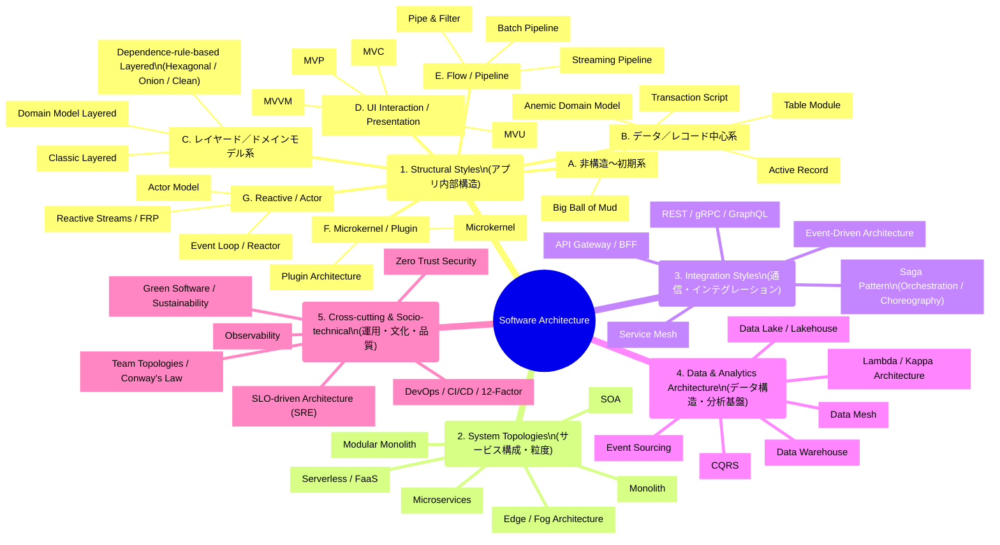
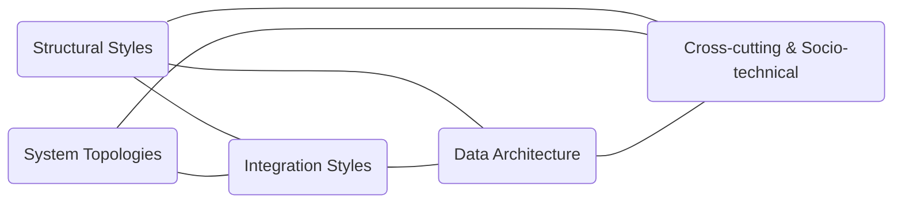

了解です。
ここでは 「これからどのスタイルのページに、どのフレームワーク例・どのデザインパターンセットを追加するのか」
を 全スタイル分まとめて一覧化 します。

⸻

✅ Structural Styles →（フレームワーク例 / 支えるデザインパターン）総合マッピング

これはあくまで 作業前の合意（マッピング） であり、
このあと各ページに「Framework」「Design Patterns」セクションを追加する際の 仕様書 として使えます。

⸻

A. Early（非構造系）

▸ Big Ball of Mud
• Framework：特になし（アンチパターン）
• Patterns：該当なし（むしろパターン不在）

▸ Transaction Script
• Framework
• Next.js の API Route / Node.js の小関数構成など“薄い関数中心構造”
• PHP/Laravel の Controller による手続き的処理
• Patterns
• Command（操作をオブジェクト化する時）
• Template Method（処理ステップが似る場合）

⸻

B. Data-centric

▸ Active Record
• Framework
• Rails（ActiveRecord）
• Laravel（Eloquent）
• Patterns
• Template Method（永続化処理）
• Strategy（バリデーション・ロジック切り替え）
• Proxy（遅延ロード）
• Observer（変更通知）

▸ Table Module
• Framework
• Django（やや Table Module 寄り）
• Patterns
• Facade（テーブルごとにまとめた操作）
• Template Method

▸ Anemic Domain Model
• Framework
• Rails / Laravel（ドメインロジックが貧血化しやすい）
• Patterns
• Transaction Script（厳密にはパターンではないが近い構造）
• Strategy（ロジックを別に逃がす場合）

⸻

C. Layered / Domain Model / Dependency-Rule 系

▸ Classic Layered（3 層）
• Framework
• Spring Boot
• .NET
• NestJS
• Angular（UI だが 3 層構造が自然）
• Patterns
• Facade（アプリケーション層）
• Strategy（ビジネスロジック）
• Template Method
• Proxy（外部アクセス）

▸ Domain Model Layered
• Framework
• Spring Boot / .NET
• Patterns
• Composite（集約/エンティティ構造）
• Strategy（振る舞いの差し替え）
• Mediator（複雑な協調）

▸ Dependency-rule-based Layered（Hexagonal / Onion / Clean）

Hexagonal
• Framework
• Spring Boot
• NestJS
• .NET
• Patterns
• Adapter
• Strategy
• Command
• Proxy
• Abstract Factory

Onion
• Framework
• Spring Boot, .NET
• Patterns
• Strategy / Command
• Repository（用語）
• Adapter

Clean Architecture
• Framework
• Spring Boot / NestJS / .NET 系テンプレート
• Patterns
• Adapter
• Strategy
• Command
• Facade

⸻

D. UI Interaction / Presentation 系

▸ MVC
• Framework
• Rails
• Django
• ASP.NET MVC
• Patterns
• Observer
• State
• Command
• Mediator

▸ MVP
• Framework
• Android（古いパターン）
• 一部 Web Client
• Patterns
• Mediator（Presenter）
• Observer
• State

▸ MVVM
• Framework
• Vue（Options API）
• Angular
• WPF / Jetpack ViewModel
• Patterns
• Observer
• Mediator
• Command
• State

▸ MVU
• Framework
• React
• Redux
• SwiftUI / Jetpack Compose
• Patterns
• State
• Command
• Observer

⸻

E. Flow / Pipeline 系

▸ Pipe & Filter
• Framework
• Unix pipeline, Node.js stream
• Patterns
• Chain of Responsibility
• Iterator
• Strategy

▸ Batch Pipeline
• Framework
• Airflow / Dagster / Argo（概念的に）
• Patterns
• Chain of Responsibility
• Template Method

▸ Streaming Pipeline
• Framework
• Kafka Streams / Flink / Beam
• Patterns
• Iterator
• Observer
• Chain of Responsibility

⸻

F. Microkernel / Plugin 系

▸ Microkernel
• Framework
• VSCode / IntelliJ（拡張モデル）
• Patterns
• Strategy
• Abstract Factory
• Proxy
• Mediator
• Facade

▸ Plugin Architecture
• Framework
• WordPress / Eclipse RCP / Chrome Extensions
• Patterns
• Strategy + Factory（プラグイン切替）
• Proxy
• Mediator

⸻

G. Reactive / Actor 系

▸ Actor Model
• Framework
• Erlang / Elixir / Akka
• Patterns
• Command
• State
• Observer
• Mediator

▸ Event Loop
• Framework
• Node.js（本命）
• Patterns
• Observer
• Command
• Mediator

▸ Reactive Streams
• Framework
• Reactor, RxJava, Akka Streams
• Patterns
• Iterator
• Observer
• Chain of Responsibility

⸻

📘 まとめ：これからの作業における“共通認識”

これから各スタイルページに追加する構成は、すべて このマッピングを元に 進める、という共通理解ができました。

各ページの末尾に以下を追加するイメージです：

⸻

▸ Framework Examples（代表フレームワーク）
• 例：Spring Boot, NestJS …

▸ Supported Design Patterns（支えるデザインパターン）
• Adapter
• Strategy
• Command
• …

⸻

これで、どのページに何を書くか が完全に明確になりました。

⸻

必要であれば、次に：
• 「追加作業をどのカテゴリから進めるか」
• 「テンプレート（書き込みフォーマット）を先に作るか」
• 「まとめて自動生成して書き込むか」

など、作業方式を決めていきましょう。
