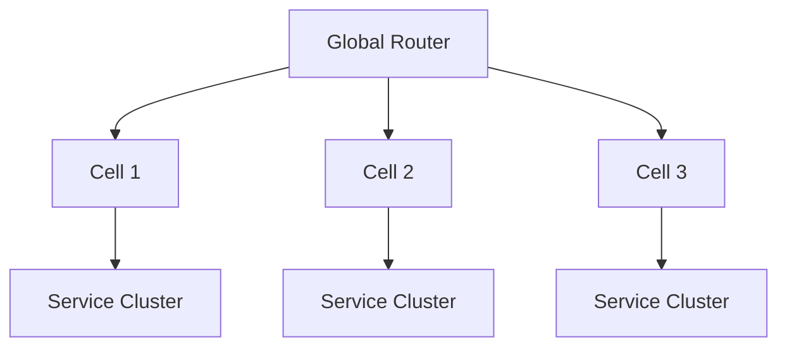

# 🧩 Cell-based Architecture

Cell-based Architecture is a topology that **configures the system in units of independent small clusters called Cells** in large-scale distributed systems. Adopted by large-scale operation organizations like Slack, Netflix, Uber.

## ✅ Overview

A structure that replicates the same function to multiple Cells and routes users to Cells to realize scale and fault isolation.

## ✅ Problems Addressed

- Limits of single region / single cluster configuration.
- Problem of Microservices becoming huge and becoming a centralized failure point.
- Increased risk during total redeployment.
- Wall of scale against massive traffic.

## ✅ Basic Philosophy & Structure

- Each Cell has independent service group + data store.
- Inter-Cell is basically loosely coupled (Minimize Cross-Cell calls).
- Scale by adding/deleting Cells.

## ✅ Suitable Applications

- Scale of millions to tens of millions of users.
- Strong fault isolation is required.
- SaaS / Messaging systems that want to scale flexibly.

## ❌ Unsuitable Cases

- Small to medium-scale systems.
- Areas where paying replication cost is not worth it.

## ✅ Related Styles

- Microservices
- Multi-region Architecture
- Sharding (Data splitting)

## ✅ Summary

Cell-based Architecture is a configuration for stable operation of ultra-large-scale systems, and is a topology balancing fault isolation and scale at a high dimension.
