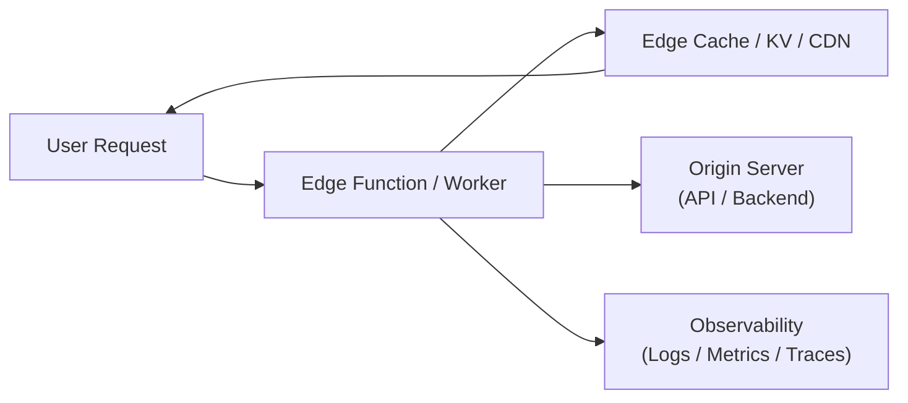

# 🧩 Edge Architecture

## ✅ Overview

**A structural style that performs processing at the "Edge" close to the user, realizing latency reduction and distributed execution.**

## ✅ Problems Addressed

- Latency problem by global users.
- Load concentration on centralized servers.
- Data explosion due to increase in IoT / Mobile.

## ✅ Basic Philosophy & Rules

- Distributed execution by CDN / Edge Functions / Worker.
- Authentication, caching, and calculation near the user.
- Role division with central server (Offloading).

### Conceptual Diagram

## ✅ Suitable Applications

- Web services deploying globally.
- Local pre-processing of IoT devices.
- Applications where low latency is important.

## ❌ Unsuitable Cases

- Too much processing placed on the edge (Complication).
- When there is strict data governance and cannot be distributed.

## ✅ History

- Developed from delivery optimization by CDN.
- Rapidly spread by Cloudflare Workers / Vercel Edge Functions.

## ✅ Related Styles

- **Serverless**: Common part with Edge FaaS.
- **Microservices**: Affinity as a direction of distributed processing.

## ✅ Representative Frameworks

- **Cloudflare Workers / D1 / KV / R2**
  Representative Edge Computing environment.

- **Vercel Edge Functions**
  Can place SSR / Middleware on the edge.

- **Fastly Compute@Edge**
  High-speed Web delivery and edge execution.

- **Akamai EdgeWorkers**
  Edge processing platform evolved from CDN.

## ✅ Design Patterns Supporting This Style

- **Proxy**
  Performs authentication, caching, and filtering at the edge.

- **Facade**
  Edge API abstracts the backend.

- **Strategy**
  Routing strategy per geography / user type.

- **Observer**
  Processing triggered by request events.

## ✅ Summary

Edge Architecture is a structural style aiming for:

- Latency reduction
- Global distribution
- Load balancing of central servers

At the same time.

On the other hand, new challenges arise such as:

- Complexity in deployment
- Dispersion of logs / traces
- Data governance and region constraints

When designing cloud frontends or APIs,
it is important to consciously design **how much to bring to the edge and from where to leave to the origin.**
