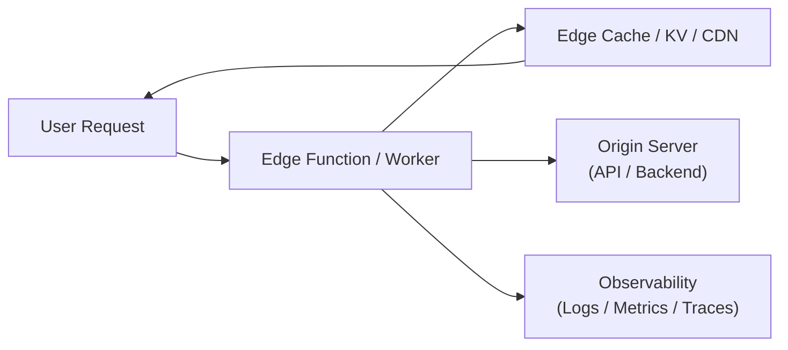

# 🧩 Edge Architecture

## ✅ このスタイルの概要

**ユーザーに近い“エッジ”で処理を行い、レイテンシ削減や分散実行を実現する構造スタイル。**

## ✅ 解決しようとした問題

- グローバルユーザーによるレイテンシ問題
- 中央集権サーバの負荷集中
- IoT / モバイルの増加によるデータ爆発

## ✅ 基本思想・ルール

- CDN / Edge Functions / Worker による分散実行
- ユーザー近傍での認証・キャッシュ・計算
- 中央サーバとの役割分担（オフロード）

### 概念図（Conceptual Diagram）

## ✅ 得意なアプリケーション

- グローバルに展開する Web サービス
- IoT デバイスのローカル前処理
- 低レイテンシが重要なアプリケーション

## ❌ 不向きなケース

- エッジに置く処理が多すぎる（複雑化）
- 厳しいデータガバナンスがあり分散できない場合

## ✅ 歴史

- CDN による配信最適化から発展
- Cloudflare Workers / Vercel Edge Functions により急速に普及

## ✅ 関連スタイル

- Serverless：エッジ FaaS との共通部分
- Microservices：分散処理の方向性として親和性あり

## ✅ 代表的なフレームワーク

- **Cloudflare Workers / D1 / KV / R2**  
  代表的な Edge Computing 環境。

- **Vercel Edge Functions**  
  SSR / Middleware をエッジに配置可能。

- **Fastly Compute@Edge**  
  高速 Web 配信とエッジ実行。

- **Akamai EdgeWorkers**  
  CDN から進化したエッジ処理基盤。

## ✅ このスタイルを支えるデザインパターン

- **Proxy**  
  エッジで認証・キャッシュ・フィルタリングを行う。

- **Facade**  
  エッジ API がバックエンドを抽象化。

- **Strategy**  
  地理・ユーザー種別ごとのルーティング戦略。

- **Observer**  
  リクエストイベントをトリガーに処理。

## ✅ まとめ

Edge Architecture は、

- レイテンシ削減
- グローバル分散
- 中央サーバの負荷分散

を同時に狙うための構造スタイルである。

一方で、

- デプロイ面での複雑さ
- ログ・トレースの分散
- データガバナンスやリージョン制約

といった新しい課題も生まれる。

クラウドフロントエンドや API の設計時には、
**どこまでをエッジに寄せ、どこからをオリジンに任せるか** を意識的に設計することが重要である。
