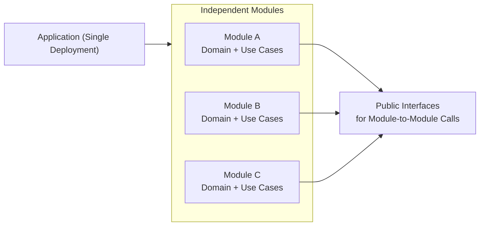

# 🧩 Modular Monolith

## ✅ Overview

**A structural style that is a Monolith but configured internally with "clearly separated modules".**

### Conceptual Diagram

## ✅ Problems Addressed

- Tight coupling, change collision, and ambiguous boundaries of [Monolith](./monolith.md).
- Want to avoid "operational cost" and "complexity" of [Microservices](./microservices.md).
- Want to separate only the internal structure firmly.

## ✅ Basic Philosophy & Rules

- Single deployment, but internally split by clear boundaries.
- Modules are configured as independent domains/packages.
- Inter-module communication is limited to public interfaces.

## ✅ Suitable Applications

- Initial stage of medium to large-scale products.
- Areas with clear domain boundaries.
- Pre-structure when considering future microservices migration.

## ❌ Unsuitable Cases

- Teams that don't observe boundaries and end up tightly coupled.
- Strong availability requirements (cannot tolerate partial outage).
- Scale characteristics differ extremely per service.

## ✅ History

- Attracted attention with the emergence of DDD.
- Re-evaluated as a reaction to [Microservices](./microservices.md).

## ✅ Related Styles

- **[Monolith](./monolith.md)**: Base concept.
- **[Microservices](./microservices.md)**: Good compatibility as a migration destination after growth.

## ✅ Representative Frameworks

- **Spring Boot + Module Boundary (Package by Feature)**  
  Representative configuration of Modular Monolith protecting model boundaries.

- **NestJS (Module Structure)**  
  Supports clear module boundaries, suitable for Modular Monolith.

- **.NET (Modular Monolith Template)**  
  Can realize DDD + Module boundaries with official templates.

- **Laravel / Rails (Engine / Module Pattern)**  
  Configuration to cut out modules partially is possible.

## ✅ Design Patterns Supporting This Style

- **Facade**  
  Functions as an entrance of API exposed to outside of the module.

- **Mediator**  
  Commonizes coordination logic between modules.

- **Adapter**  
  Used when performing inter-module communication via interfaces.

- **Strategy**  
  Makes behavior inside module switchable.

- **Proxy**  
  Useful for module boundary protection and access control.

## ✅ Summary

Modular Monolith is a structural style that balances  
**"Simplicity of Monolith" and "Boundary awareness of Microservices".**
