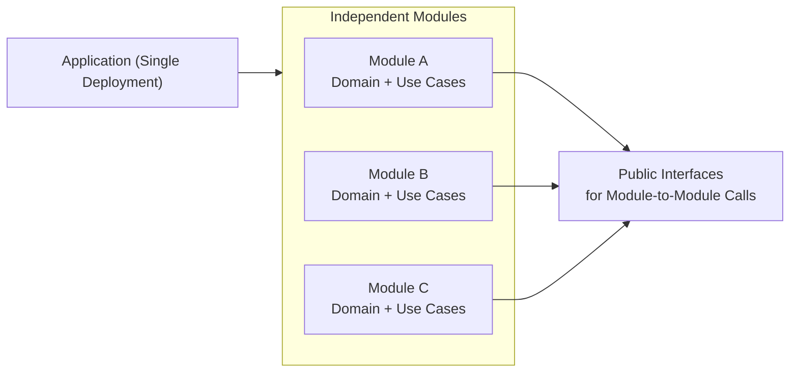

# Modular Monolith（モジュラーモノリス）

## 1. 一言でいうと

**モノリスでありながら、内部を「明確に分割されたモジュール」で構成する構造スタイル。**

---

## 3.1 概念図（Conceptual Diagram）

---

## 2. 解決しようとした問題

- モノリスの密結合・変更衝突・境界の曖昧さ
- Microservices の「運用コスト」や「複雑性」を避けたい
- 内部構造だけはしっかり分離したい

---

## 3. 基本思想・ルール

- 単一デプロイだが、内部は明確な境界で分割
- モジュールは独立したドメイン・パッケージとして構成
- モジュール間通信は公開インターフェース経由に限定

---

## 4. 得意なアプリケーション

- 中規模〜大規模のプロダクト初期
- 明確なドメイン境界がある領域
- 将来的にマイクロサービス化を検討したい場合の事前構造

---

## 5. 不向きなケース

- 境界を守らず結局密結合になるチーム
- 強い可用性要件（部分停止を許容できない）
- サービスごとにスケール特性が極端に異なる

---

## 6. 歴史

- DDD の登場により注目される
- Microservices の反動として再評価

---

## 7. 関連スタイル

- Monolith：基盤となる概念
- Microservices：成長後の移行先として相性が良い

---

## 8. Framework Examples（代表的なスタック）

- **Spring Boot + Module Boundary（Package by Feature）**  
  モデル境界を守るモジュラーモノリスの代表的構成。

- **NestJS（Module 構造）**  
  明確なモジュール境界をサポートし、モジュラーモノリスに適する。

- **.NET（Modular Monolith Template）**  
  DDD + モジュール境界を公式テンプレートで実現可能。

- **Laravel / Rails（Engine / Module パターン）**  
  部分的にモジュールを切り出す構成が可能。

---

## 9. Supported Design Patterns（このスタイルを支えるデザインパターン）

- **Facade**  
  モジュール外部に公開する API の入口として機能。

- **Mediator**  
  モジュール間の調整ロジックを共通化。

- **Adapter**  
  モジュール間通信をインターフェース経由で行う際に利用。

- **Strategy**  
  モジュール内部の振る舞いを切り替え可能にする。

- **Proxy**  
  モジュールの境界保護・アクセス制御に役立つ。

---

## 10. まとめ

Modular Monolith は  
**「モノリスのシンプルさ」と「マイクロサービスの境界意識」** を両立させる構造スタイルです。
