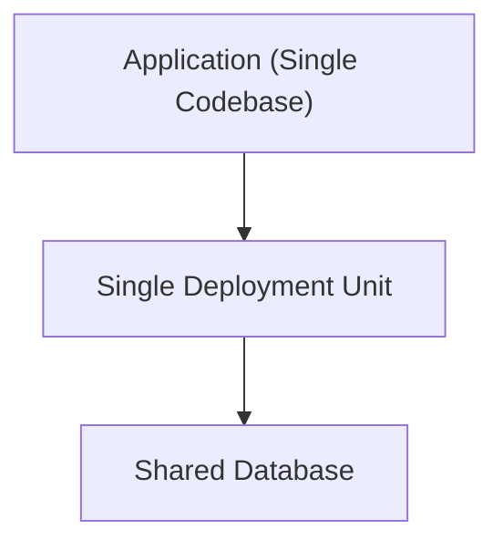

# 🧩 Monolith

## ✅ Overview

**A structural style where application functions are gathered as a single deployment unit.**

## ✅ Problems Addressed

- Want to maximize development speed in small to medium-scale apps.
- Want to keep deployment and release simple.
- Want changes/additions between functions to be reflected quickly.

## ✅ Basic Philosophy & Rules

- One codebase, one database (often).
- Released in one deployment package.
- Functions tend to be tightly coupled by inter-function calls.

### Conceptual Diagram

## ✅ Suitable Applications

- Initial Product (MVP).
- Small to medium-scale business systems.
- Environments with small teams.

## ❌ Unsuitable Cases

- Large team scale.
- Module boundaries collide frequently.
- Independence of release is required.

## ✅ History

- Common structure since the early days of Web applications.
- Role redefined with the rise of SOA → Microservices.

## ✅ Related Styles

- **Modular Monolith**: Advanced form organizing Monolith structurally.
- **Microservices**: Opposite model with different deployment granularity.

## ✅ Representative Frameworks

- **Ruby on Rails / Laravel / Django**
  Typical monolith configuring MVC in a single application.

- **Spring Boot (Single WAR/JAR deployment)**
  Used in many enterprise systems as monolith configuration.

- **Next.js (Monolith configuration)**
  Structure aggregating API Routes + Web UI + SSR into 1 project.

- **.NET MVC / ASP.NET Core**
  Widely adopted in enterprise system monolith construction.

## ✅ Design Patterns Supporting This Style

- **Facade**
  Unifies the entrance (Controller) of the entire app.

- **Template Method**
  Unifies common processing (Validation → Execution → Response).

- **Strategy**
  When switching algorithms within a module.

- **Composite**
  Handles UI or domain structure hierarchically.

- **Mediator**
  Adjusts coordination of multiple modules within a large monolith.

## ✅ Summary

Monolith excels in simplicity, speed, and ease of change,
and remains the **strongest candidate for small to medium-scale systems.**
