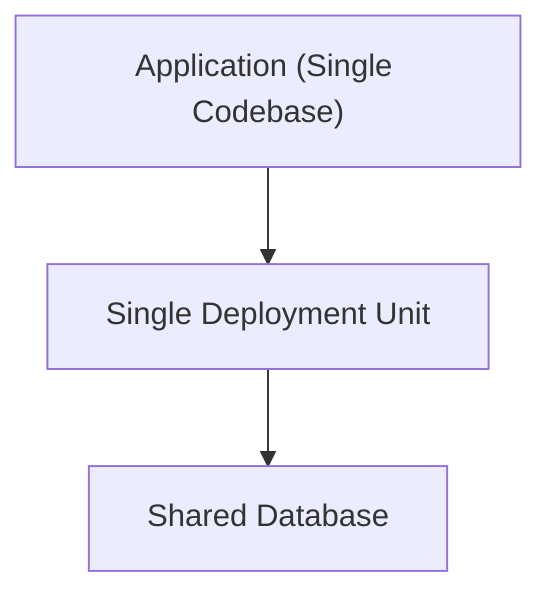

# Monolith（モノリス）

## 1. 一言でいうと

**アプリケーションの機能が単一デプロイユニットとしてまとまっている構造スタイル。**

---

## 2. 解決しようとした問題

- 小規模〜中規模アプリで開発速度を最大化したい
- デプロイやリリースをシンプルに保ちたい
- 機能間の変更・追加が素早く反映されるようにしたい

---

## 3. 基本思想・ルール

- 1 つのコードベース、1 つのデータベース（であることが多い）
- 1 つのデプロイパッケージでリリース
- 関数間呼び出しで機能が密結合になりやすい

---

## 3.1 概念図（Conceptual Diagram）

---

## 4. 得意なアプリケーション

- 初期プロダクト（MVP）
- 小規模〜中規模の業務システム
- チームが少人数の環境

---

## 5. 不向きなケース

- チーム規模が大きい
- モジュール境界が頻繁に衝突する
- リリースの独立性が求められる

---

## 6. 歴史

- Web アプリケーション初期から一般的な構造
- SOA → Microservices の台頭で役割が再定義された

---

## 7. 関連スタイル

- Modular Monolith：モノリスを構造的に整理した発展型
- Microservices：デプロイ粒度が異なる対極的モデル

---

## 8. Framework Examples（代表的なスタック）

- **Ruby on Rails / Laravel / Django**  
  単一アプリケーションで MVC を構成する典型的モノリス。

- **Spring Boot（単一 WAR/JAR デプロイ）**  
  モノリス構成として多数の企業システムで利用。

- **Next.js（モノリス構成）**  
  API Routes + Web UI + SSR を 1 プロジェクトに集約する構造。

- **.NET MVC / ASP.NET Core**  
  企業システムのモノリス構築で広く採用。

---

## 9. Supported Design Patterns（このスタイルを支えるデザインパターン）

- **Facade**  
  アプリ全体の入り口（Controller）を統一化。

- **Template Method**  
  共通的な処理（バリデーション → 実行 → レスポンス）を統一。

- **Strategy**  
  モジュール内でアルゴリズム切り替えを行う際。

- **Composite**  
  UI やドメイン構造を階層的に扱う。

- **Mediator**  
  大規模モノリス内で複数モジュールの連携を調整。

---

## 10. まとめ

モノリスは単純・高速・変更容易性に優れ、  
**小〜中規模システムでは依然として最有力候補** となる構造スタイルです。
