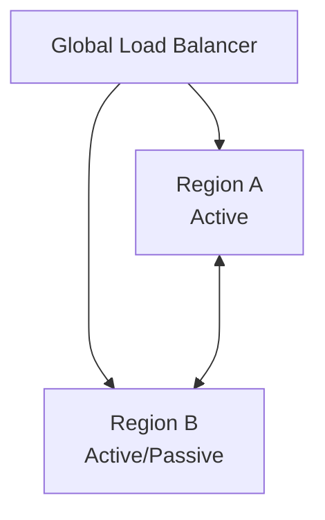

# 🧩 Multi-region Architecture

Multi-region Architecture is a topology that deploys services to multiple regions and **satisfies availability, latency, and disaster recovery simultaneously.**

## ✅ Overview

Deploys applications and data to multiple regions and operates in Active-active / Active-passive configuration.

## ✅ Problems Addressed

- Total outage due to single region failure.
- High latency for global users.
- Delay in Disaster Recovery (DR) / Failover.
- Balancing data consistency and scale.

## ✅ Basic Philosophy & Structure

- Routes users to optimal region by Global Load Balancing.
- Select Strong / Eventual Consistency.
- Decide configuration according to RPO/RTO requirements.

## ✅ Representative Configuration Patterns

### ● Active-active

- All regions operate simultaneously.
- High availability / Low latency.
- Design of data consistency is difficult.

### ● Active-passive

- One side stands by and switches at failure.
- Simple and predictable.
- Takes time for failover.

## ❌ Unsuitable Cases

- Apps centered on single DB where strong consistency cannot be broken absolutely.
- Scale that cannot absorb inter-region communication cost.

## ✅ Related Styles

- [Cell-based Architecture](./cell-based.md)
- [Event-driven Architecture](../integration/event-driven.md) (Asynchronous replication)
- Global Caching / CDN

## ✅ Summary

Multi-region Architecture is a configuration essential for global services, realizing availability, disaster tolerance, and latency improvement at a high level.
